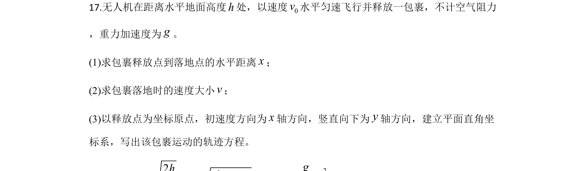
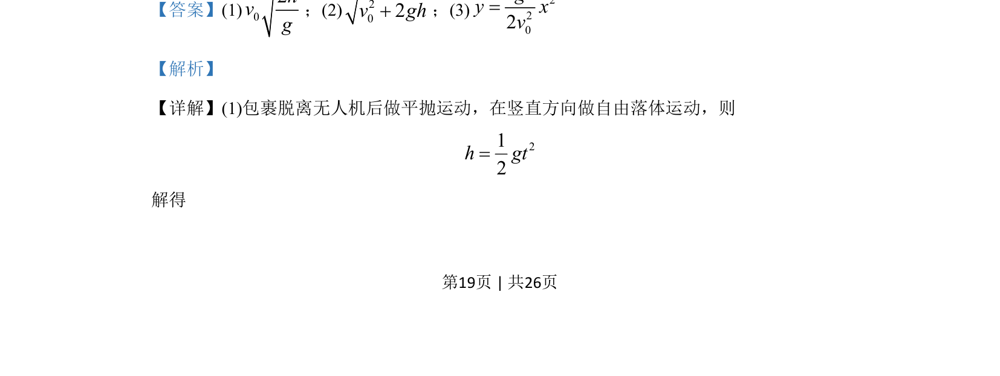
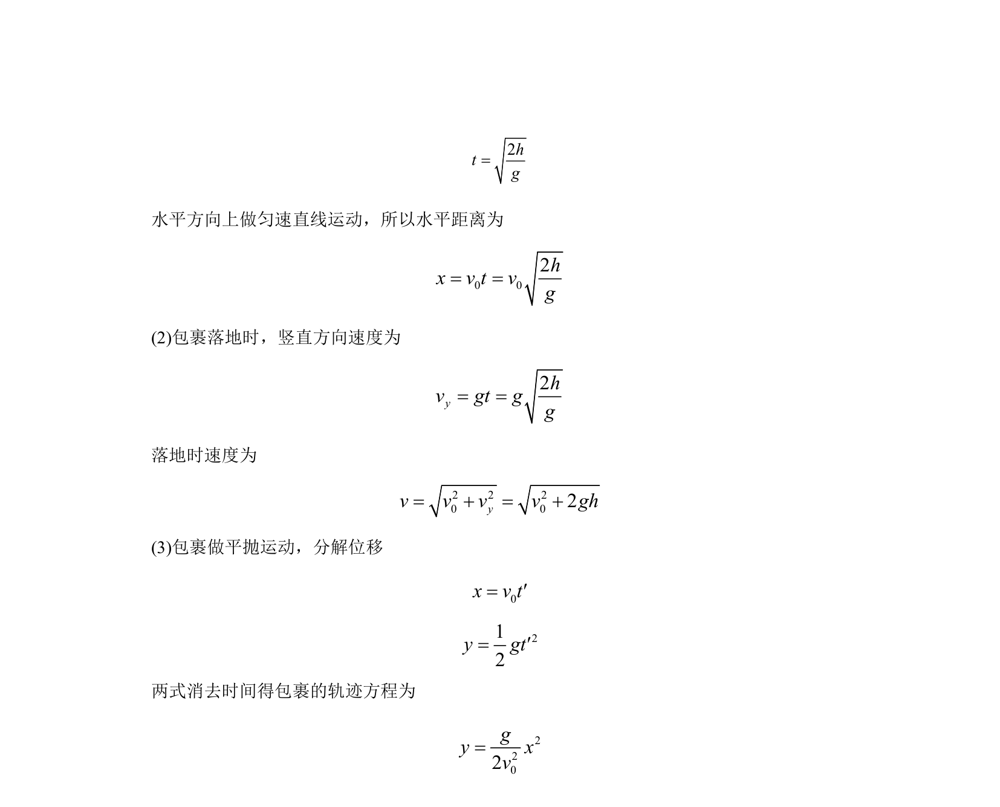

## 题面

## 摘要

包裹做平抛运动，求下落时间、水平位移、落地速度及轨迹方程。

## 关联考点

- [[261-平抛运动|平抛运动]]
- [[288-运动的合成与分解|运动的合成与分解]]
- [[854-自由落体|自由落体]]

## 答案与解析

> 📄 原 PDF 第 19 页：`素材/真题/北京/2008-2024·（北京）物理高考真题/2020年高考物理试卷（北京）（解析卷）.pdf`
