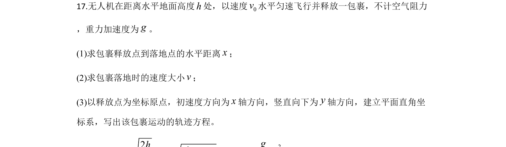
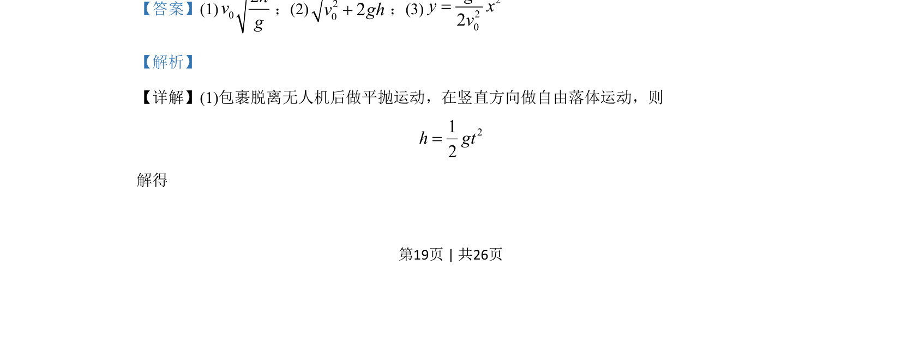
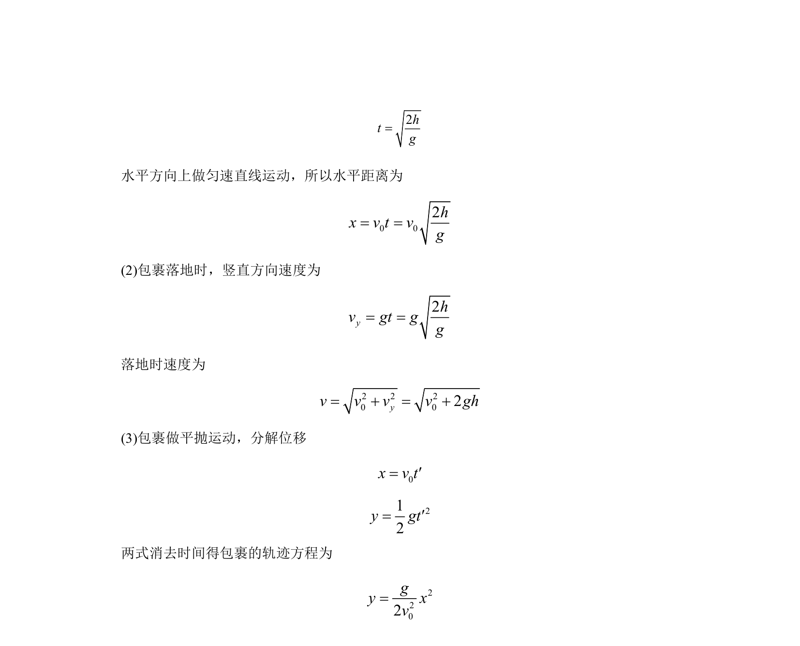

## 题面

## 摘要

包裹做平抛运动，求下落时间、水平位移、落地速度及轨迹方程。

## 关联考点

- [[261-平抛运动|平抛运动]]
- [[288-运动的合成与分解|运动的合成与分解]]
- [[854-自由落体|自由落体]]

## 答案与解析

> 📄 原 PDF 第 19 页：`素材/真题/北京/2008-2024·（北京）物理高考真题/2020年高考物理试卷（北京）（解析卷）.pdf`

<!-- 题干文本-start -->
## 题干文本
17.无人机在距离水平地面高度h处，以速度0v水平匀速飞行并释放一包裹，不计空气阻力
，重力加速度为g。
(1)求包裹释放点到落地点的水平距离x；
(2)求包裹落地时的速度大小v；
(3)以释放点为坐标原点，初速度方向为x轴方向，竖直向下为y轴方向，建立平面直角坐
标系，写出该包裹运动的轨迹方程。
<!-- 题干文本-end -->

<!-- 解析文本-start -->
## 解析文本
【答案】(1)02hvg
；(2)202v gh+；(3) 2202gy xv=
【解析】
【详解】(1)包裹脱离无人机后做平抛运动，在竖直方向做自由落体运动，则
212h gt=
解得
<!-- 解析文本-end -->
