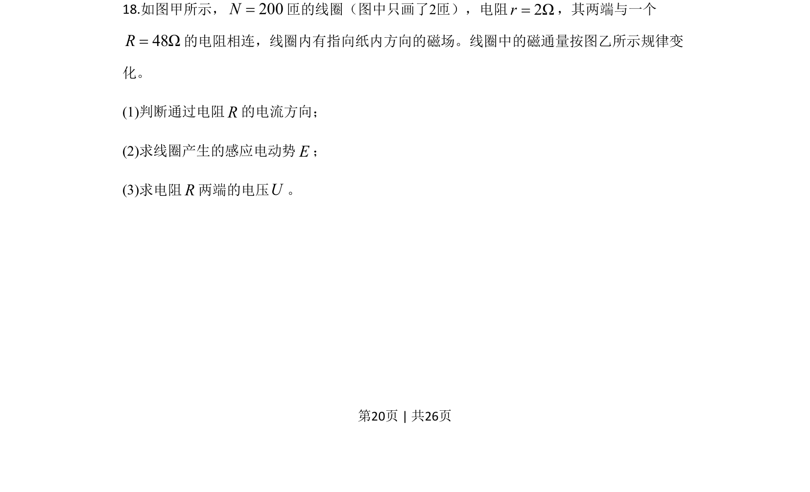
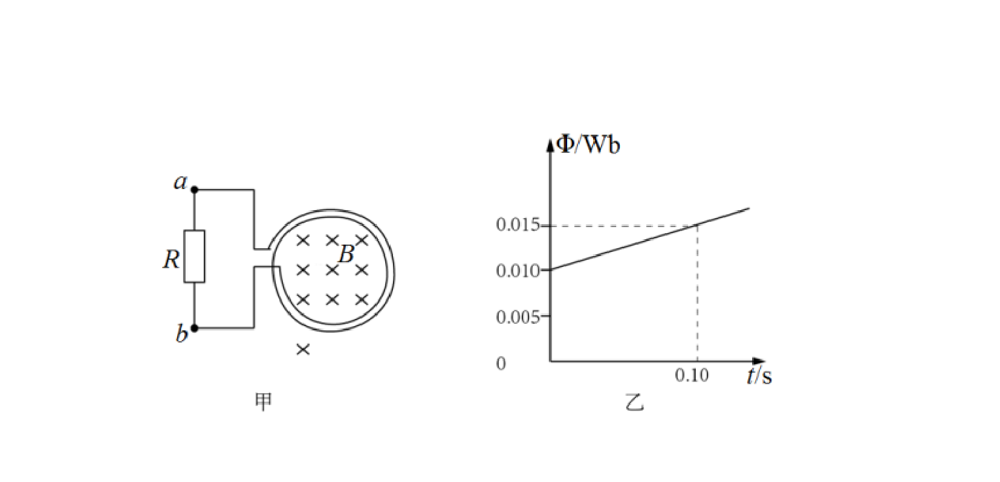
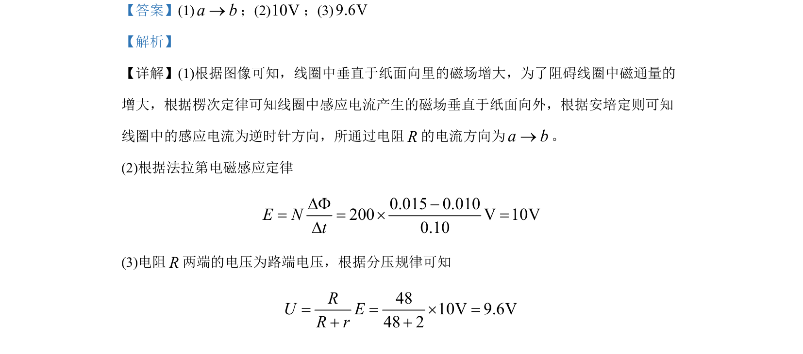

## 题面

## 摘要

考查电磁感应中楞次定律判断感应电流方向、法拉第电磁感应定律计算电动势及闭合电路欧姆定律求路端电压。

## 关联考点

- [[393-楞次定律|楞次定律]]
- [[395-法拉第电磁感应定律|法拉第电磁感应定律]]
- [[332-闭合电路欧姆定律|闭合电路欧姆定律]]

## 答案与解析

> 📄 原 PDF 第 20 页：`素材/真题/北京/2008-2024·（北京）物理高考真题/2020年高考物理试卷（北京）（解析卷）.pdf`
