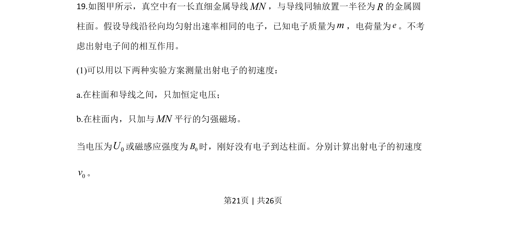
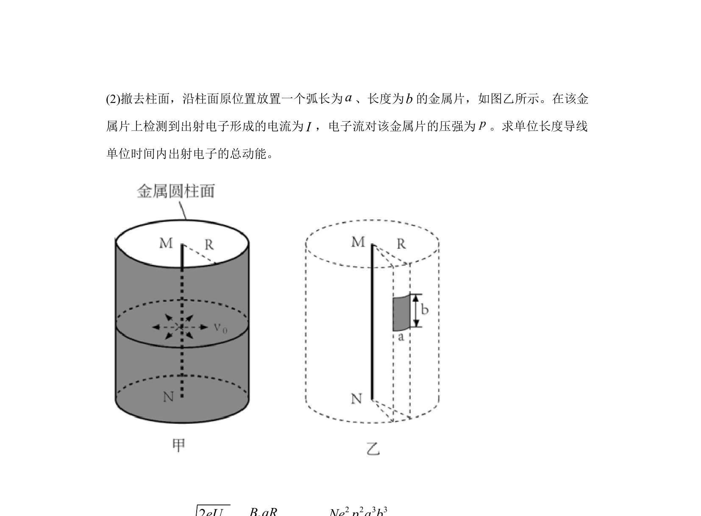
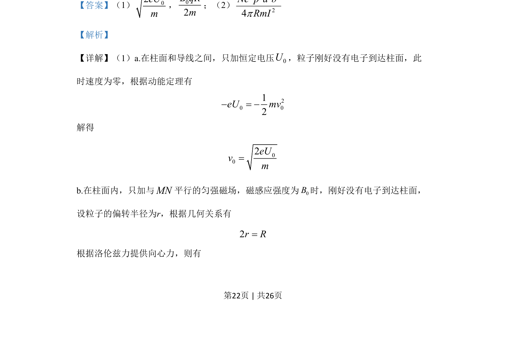
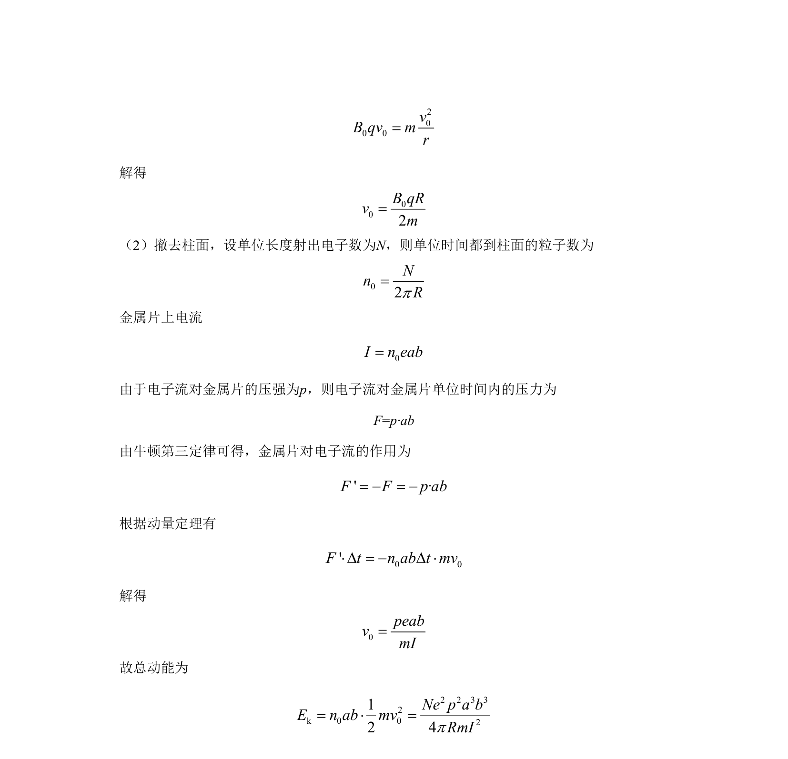

## 题面

## 摘要

该题通过电子在电场和磁场中的运动，结合电流微观表达式和动量定理计算电子动能。

## 关联考点

- [[251-动能定理|动能定理]]
- [[649-洛伦兹力提供向心力|洛伦兹力提供向心力]]
- [[849-电流微观表达式|电流微观表达式]]
- [[349-动量定理|动量定理]]

## 答案与解析

> 📄 原 PDF 第 21 页：`素材/真题/北京/2008-2024·（北京）物理高考真题/2020年高考物理试卷（北京）（解析卷）.pdf`
