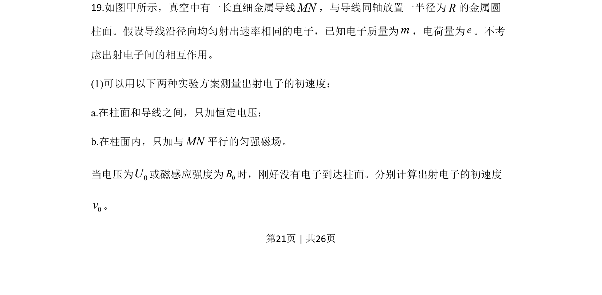
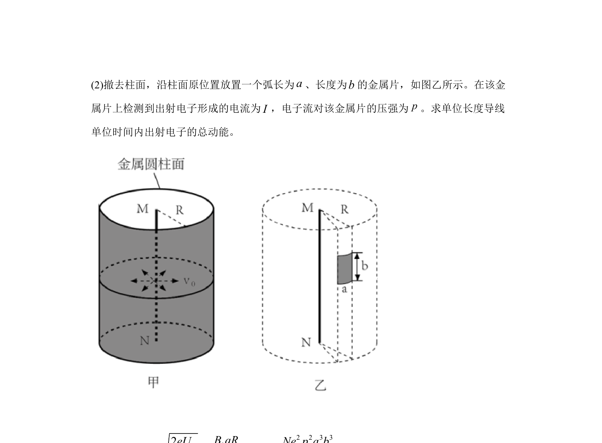
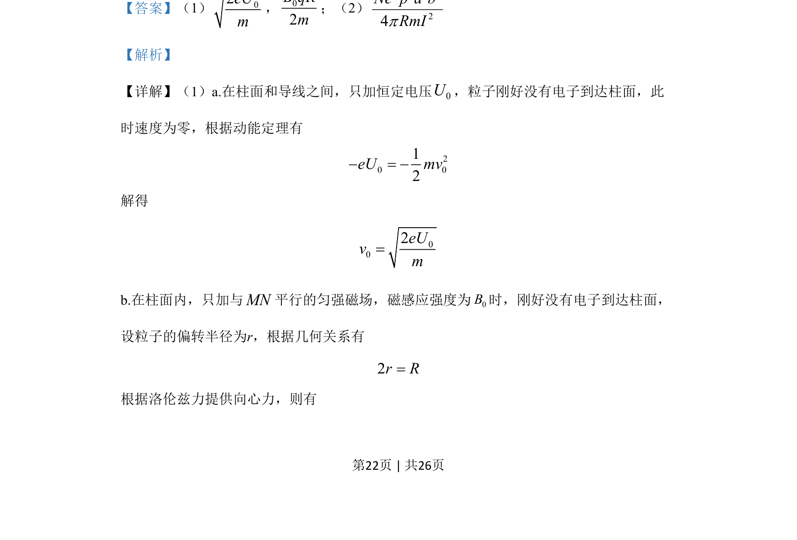
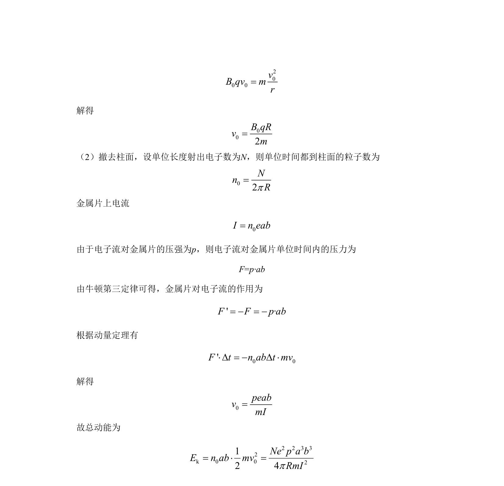

## 题面

## 摘要

该题通过电子在电场和磁场中的运动，结合电流微观表达式和动量定理计算电子动能。

## 关联考点

- [[251-动能定理|动能定理]]
- [[649-洛伦兹力提供向心力|洛伦兹力提供向心力]]
- [[849-电流微观表达式|电流微观表达式]]
- [[349-动量定理|动量定理]]

## 答案与解析

> 📄 原 PDF 第 21 页：`素材/真题/北京/2008-2024·（北京）物理高考真题/2020年高考物理试卷（北京）（解析卷）.pdf`

<!-- 题干文本-start -->
## 题干文本
19.如图甲所示，真空中有一长直细金属导线MN，与导线同轴放置一半径为R的金属圆
柱面。假设导线沿径向均匀射出速率相同的电子，已知电子质量为m，电荷量为e。不考
虑出射电子间的相互作用。
(1)可以用以下两种实验方案测量出射电子的初速度：
a.在柱面和导线之间，只加恒定电压；
b.在柱面内，只加与MN平行的匀强磁场。
当电压为0U或磁感应强度为0B时，刚好没有电子到达柱面。分别计算出射电子的初速度
0v。
<!-- 题干文本-end -->

<!-- 解析文本-start -->
## 解析文本

<!-- 解析文本-end -->
