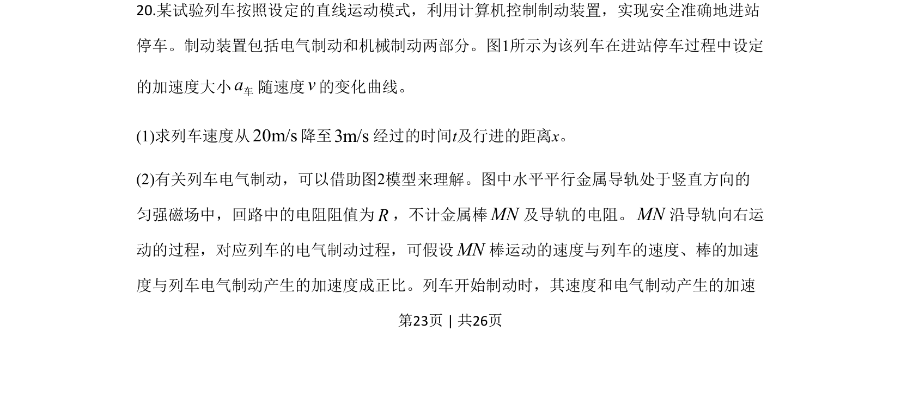
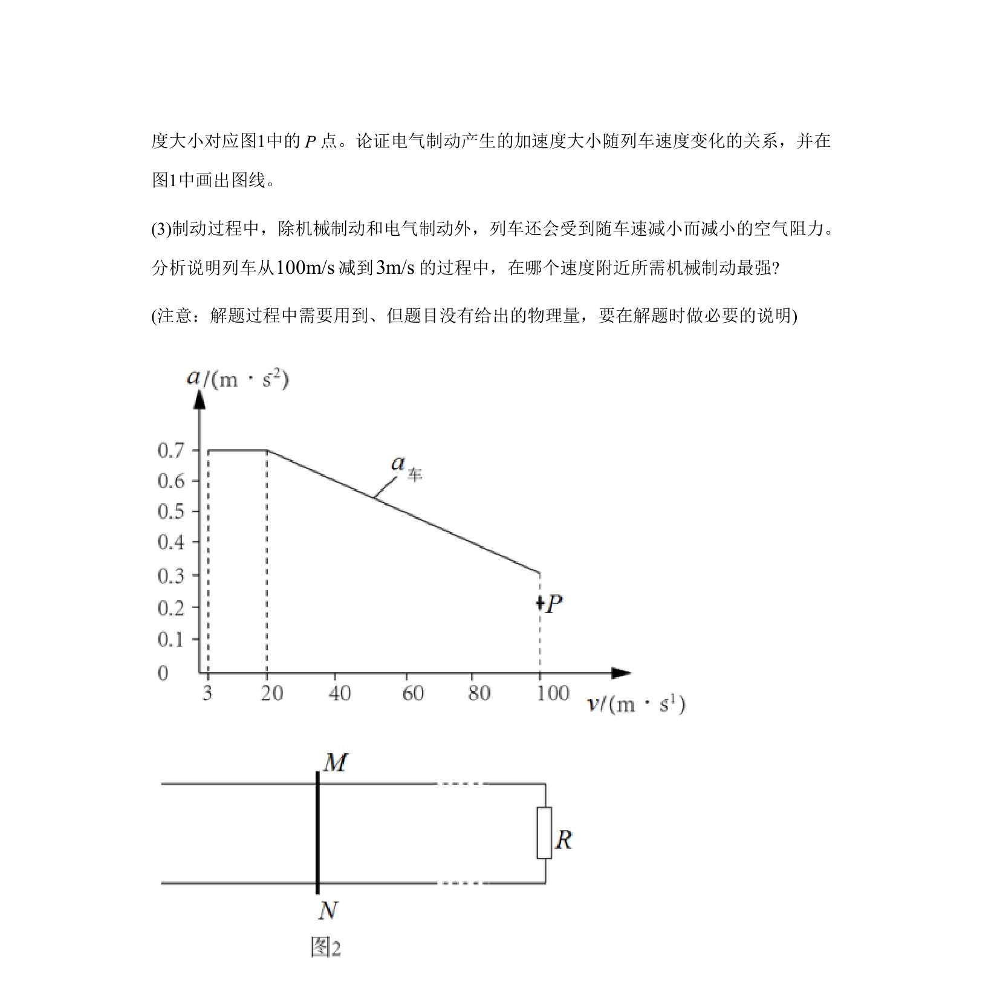
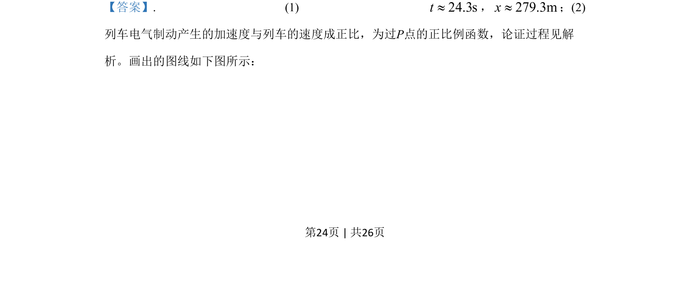
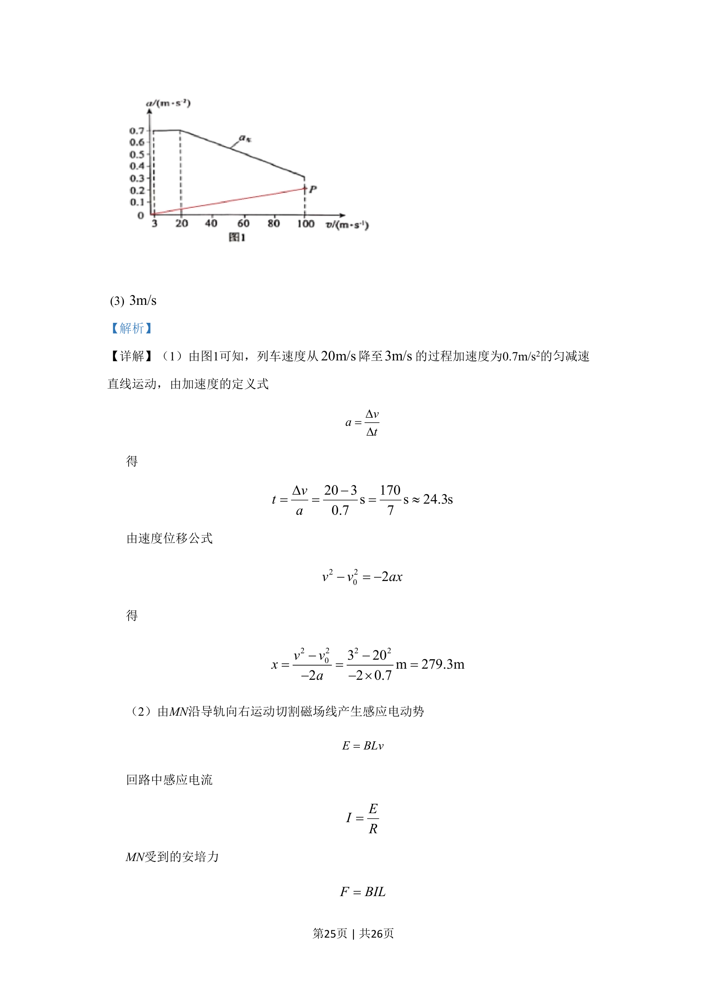
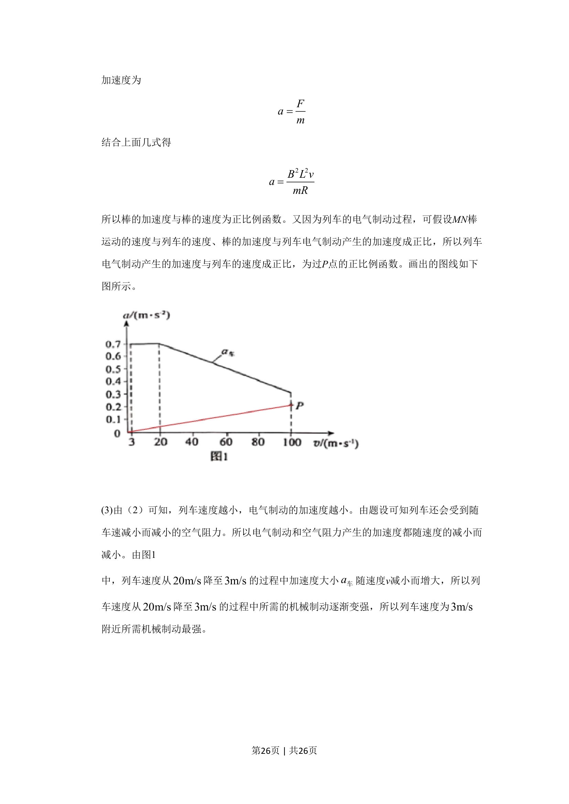

## 题面

## 摘要

本题结合列车制动情境，综合考查匀变速直线运动、电磁感应与安培力作用下的动力学分析。

## 关联考点

- [[794-匀变速直线运动公式|匀变速直线运动公式]]
- [[395-法拉第电磁感应定律|法拉第电磁感应定律]]
- [[188-磁场对通电导体的作用|安培力]]
- [[229-牛顿第二定律|牛顿第二定律]]

## 答案与解析

> 📄 原 PDF 第 23 页：`素材/真题/北京/2008-2024·（北京）物理高考真题/2020年高考物理试卷（北京）（解析卷）.pdf`
