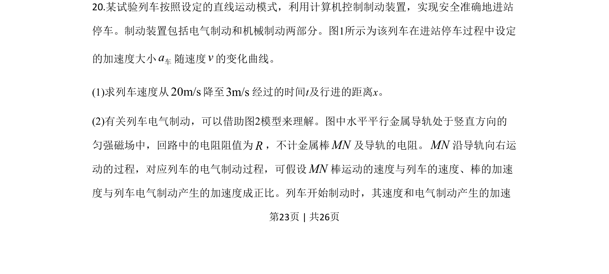
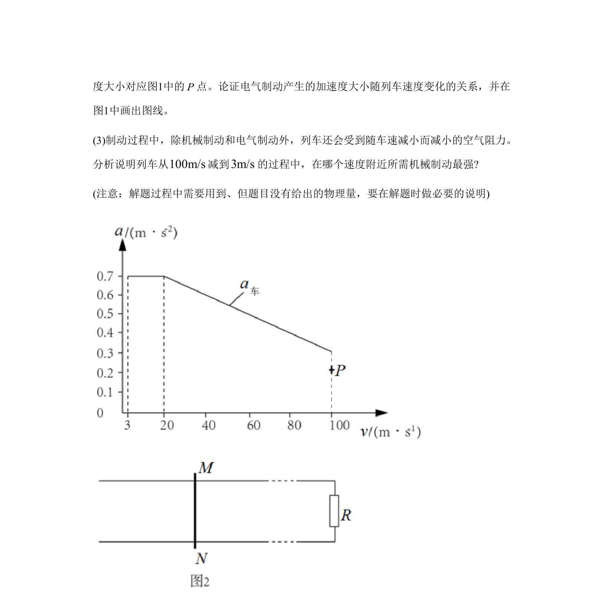
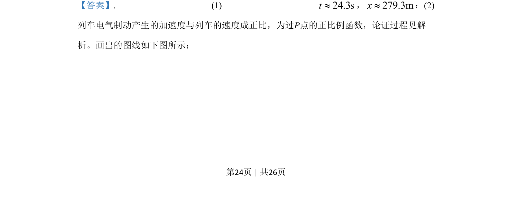
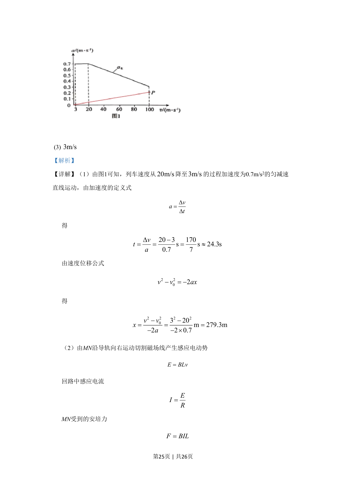
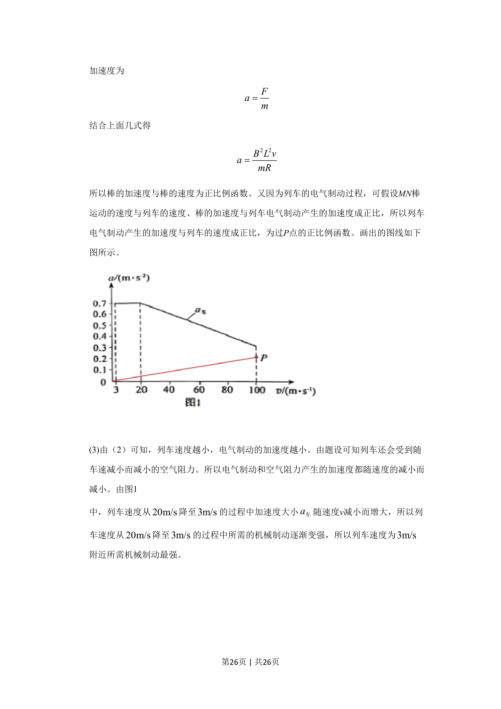

## 题面

## 摘要

本题结合列车制动情境，综合考查匀变速直线运动、电磁感应与安培力作用下的动力学分析。

## 关联考点

- [[794-匀变速直线运动公式|匀变速直线运动公式]]
- [[395-法拉第电磁感应定律|法拉第电磁感应定律]]
- [[188-磁场对通电导体的作用|安培力]]
- [[229-牛顿第二定律|牛顿第二定律]]

## 答案与解析

> 📄 原 PDF 第 23 页：`素材/真题/北京/2008-2024·（北京）物理高考真题/2020年高考物理试卷（北京）（解析卷）.pdf`

<!-- 题干文本-start -->
## 题干文本
20.某试验列车按照设定的直线运动模式，利用计算机控制制动装置，实现安全准确地进站
停车。制动装置包括电气制动和机械制动两部分。图1所示为该列车在进站停车过程中设定
的加速度大小a车随速度v的变化曲线。
(1)求列车速度从20m/s降至3m/s经过的时间t及行进的距离x。
(2)有关列车电气制动，可以借助图2模型来理解。图中水平平行金属导轨处于竖直方向的
匀强磁场中，回路中的电阻阻值为R，不计金属棒MN及导轨的电阻。MN沿导轨向右运
动的过程，对应列车的电气制动过程，可假设MN棒运动的速度与列车的速度、棒的加速
度与列车电气制动产生的加速度成正比。列车开始制动时，其速度和电气制动产生的加速
<!-- 题干文本-end -->

<!-- 解析文本-start -->
## 解析文本

<!-- 解析文本-end -->
