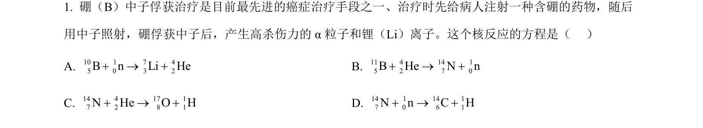
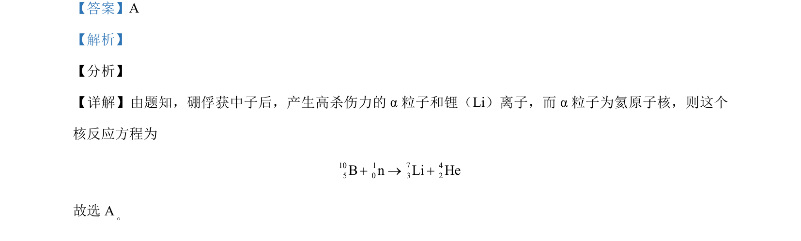

## 题面

## 摘要

考查硼俘获中子的核反应方程书写，需根据质量数和电荷数守恒判断产物。

## 关联考点

- [[629-核反应方程|核反应方程]]
- [[728-质量数守恒|质量数守恒]]
- [[689-电荷数守恒|电荷数守恒]]

## 答案与解析

> 📄 原 PDF 第 1 页：`素材/真题/北京/2008-2024·（北京）物理高考真题/2021年高考物理试卷（北京）（解析卷）.pdf`

<!-- 题干文本-start -->
## 题干文本
1. 硼（B）中子俘获治疗是目前最先进的癌症治疗手段之一、治疗时先给病人注射一种含硼的药物，随后
用中子照射，硼俘获中子后，产生高杀伤力的 α粒子和锂（Li）离子。这个核反应的方程是（   ）
A. 10 1 7 45 0 3 2B n Li He+ ® +B. 11 4 14 15 2 7 0B He N n+ ® +
C. 14 4 17 17 2 8 1N He O H+ ® +D. 14 1 14 17 0 6 1N n C H+ ® +
<!-- 题干文本-end -->

<!-- 解析文本-start -->
## 解析文本
【答案】A
【解析】
【分析】
【详解】由题知，硼俘获中子后，产生高杀伤力的 α 粒子和锂（Li）离子，而 α 粒子为氦原子核，则这个
核反应方程为
10 1 7 45 0 3 2B n Li He+ ® +
故选 A
<!-- 解析文本-end -->
