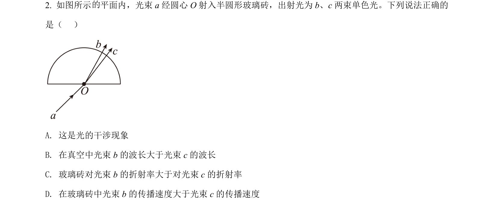
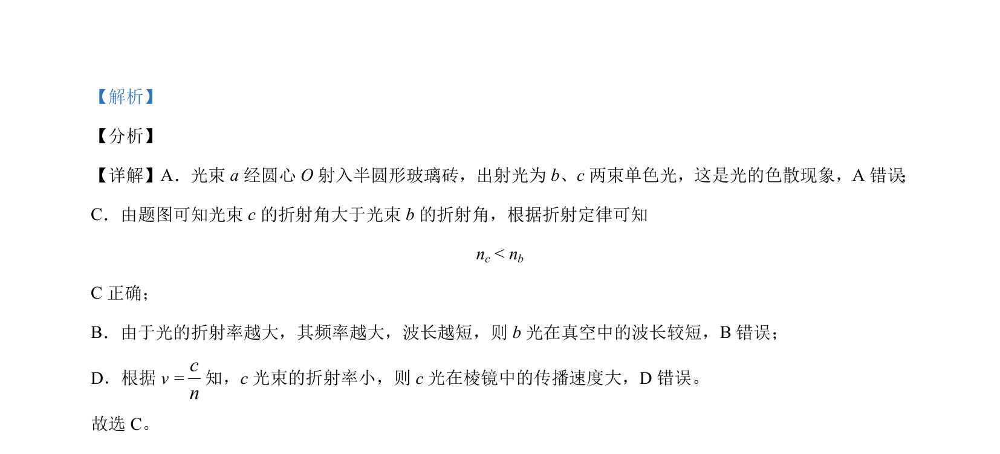

## 题面

## 摘要

光通过半圆形玻璃砖发生色散，比较不同色光的折射率、波长和传播速度。

## 关联考点

- [[005-光的色散|光的色散]]
- [[026-折射定律|折射定律]]
- [[360-折射率|折射率]]
- [[006-光速|光速]]

## 答案与解析

> 📄 原 PDF 第 1 页：`素材/真题/北京/2008-2024·（北京）物理高考真题/2021年高考物理试卷（北京）（解析卷）.pdf`
