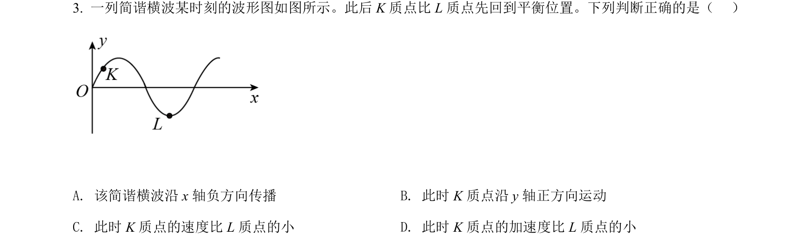
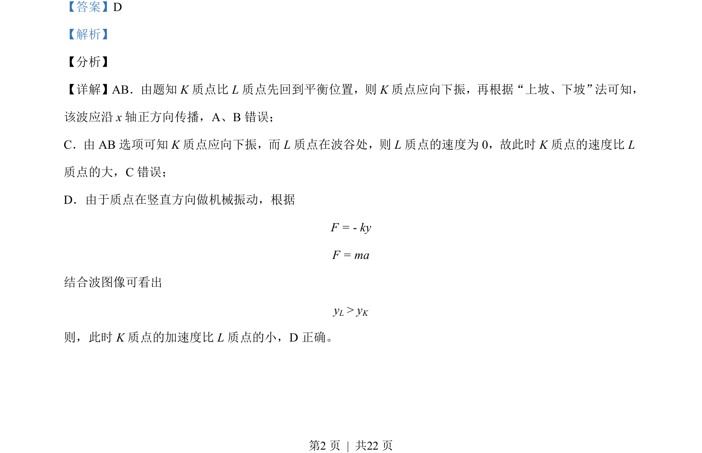

## 题面

## 摘要

本题考查机械波传播方向判断及质点振动分析，根据质点先后回到平衡位置判定波传播方向，比较质点速度与加速度大小。

## 关联考点

- [[机械波的传播]]
- [[质点振动方向判断]]
- [[回复力与加速度]]
- [[上坡下坡法]]

## 答案与解析

> 📄 原 PDF 第 2 页：`素材/真题/北京/2008-2024·（北京）物理高考真题/2021年高考物理试卷（北京）（解析卷）.pdf`
