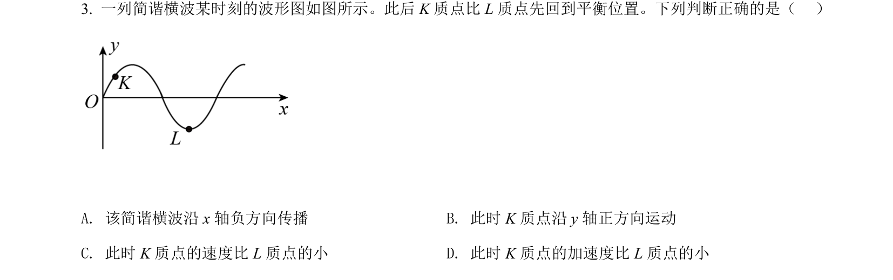
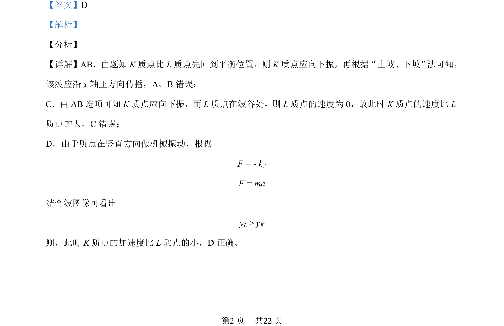

## 题面

## 摘要

本题考查机械波传播方向判断及质点振动分析，根据质点先后回到平衡位置判定波传播方向，比较质点速度与加速度大小。

## 关联考点

- [[机械波的传播]]
- [[质点振动方向判断]]
- [[回复力与加速度]]
- [[上坡下坡法]]

## 答案与解析

> 📄 原 PDF 第 2 页：`素材/真题/北京/2008-2024·（北京）物理高考真题/2021年高考物理试卷（北京）（解析卷）.pdf`

<!-- 题干文本-start -->
## 题干文本
3. 一列简谐横波某时刻的波形图如图所示。此后 K质点比 L 质点先回到平衡位置。下列判断正确的是（   ）
A. 该简谐横波沿 x轴负方向传播B. 此时 K质点沿 y轴正方向运动
C. 此时 K质点的速度比 L 质点的小D. 此时 K质点的加速度比 L 质点的小
<!-- 题干文本-end -->

<!-- 解析文本-start -->
## 解析文本
【答案】D
【解析】
【分析】
【详解】AB．由题知 K质点比 L 质点先回到平衡位置，则 K质点应向下振，再根据“上坡、下坡”法可知，
该波应沿 x轴正方向传播，A、B错误；
C．由 AB 选项可知 K质点应向下振，而 L 质点在波谷处，则 L 质点的速度为 0，故此时 K质点的速度比 L
质点的大，C错误；
D．由于质点在竖直方向做机械振动，根据
F = - ky
F = ma
结合波图像可看出
yL > yK
则，此时 K质点的加速度比 L 质点的小，D 正确。
<!-- 解析文本-end -->
