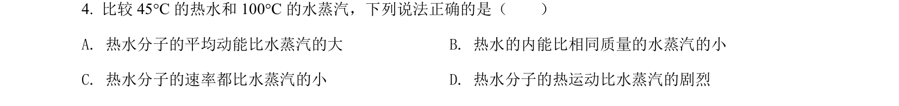
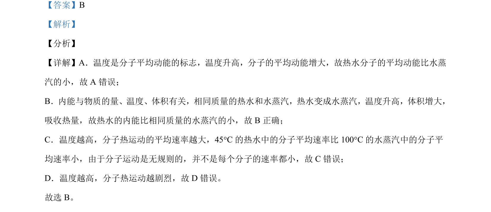

## 题面

## 摘要

通过实例辨析温度、内能、分子平均动能及分子热运动剧烈程度等概念。

## 关联考点

- [[129-分子动理论|分子动理论]]
- [[654-温度与分子平均动能|温度与分子平均动能]]
- [[127-内能|内能]]
- [[分子热运动速率]]

## 答案与解析

> 📄 原 PDF 第 3 页：`素材/真题/北京/2008-2024·（北京）物理高考真题/2021年高考物理试卷（北京）（解析卷）.pdf`
