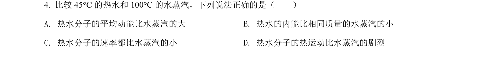
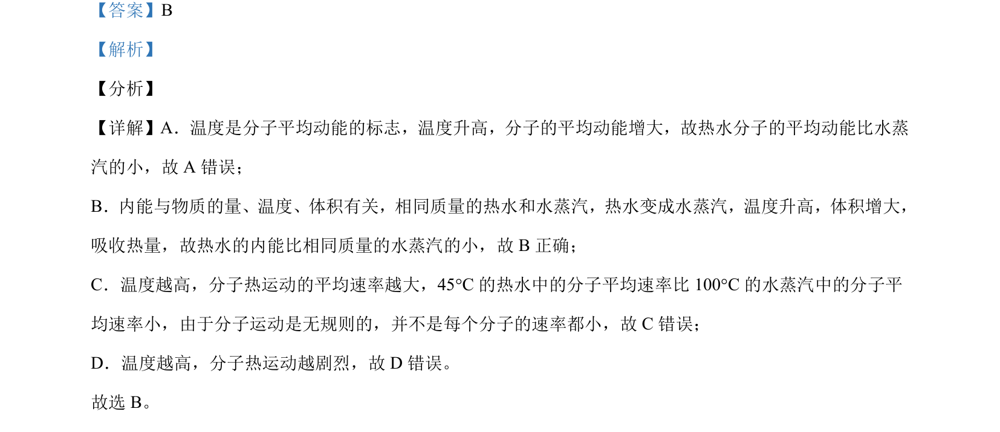

## 题面

## 摘要

通过实例辨析温度、内能、分子平均动能及分子热运动剧烈程度等概念。

## 关联考点

- [[129-分子动理论|分子动理论]]
- [[654-温度与分子平均动能|温度与分子平均动能]]
- [[127-内能|内能]]
- [[分子热运动速率]]

## 答案与解析

> 📄 原 PDF 第 3 页：`素材/真题/北京/2008-2024·（北京）物理高考真题/2021年高考物理试卷（北京）（解析卷）.pdf`

<!-- 题干文本-start -->
## 题干文本
4. 比较 45C的热水和 100C的水蒸汽，下列说法正确的是（　　）
A. 热水分子的平均动能比水蒸汽的大B. 热水的内能比相同质量的水蒸汽的小
C. 热水分子的速率都比水蒸汽的小D. 热水分子的热运动比水蒸汽的剧烈
<!-- 题干文本-end -->

<!-- 解析文本-start -->
## 解析文本
【答案】B
【解析】
【分析】
【详解】A．温度是分子平均动能的标志，温度升高，分子的平均动能增大，故热水分子的平均动能比水蒸
汽的小，故 A 错误；
B．内能与物质的量、温度、体积有关，相同质量的热水和水蒸汽，热水变成水蒸汽，温度升高，体积增大，
吸收热量，故热水的内能比相同质量的水蒸汽的小，故 B正确；
C．温度越高，分子热运动的平均速率越大，45C的热水中的分子平均速率比 100C的水蒸汽中的分子平
均速率小，由于分子运动是无规则的，并不是每个分子的速率都小，故 C错误；
D．温度越高，分子热运动越剧烈，故 D 错误。
故选 B。
<!-- 解析文本-end -->
