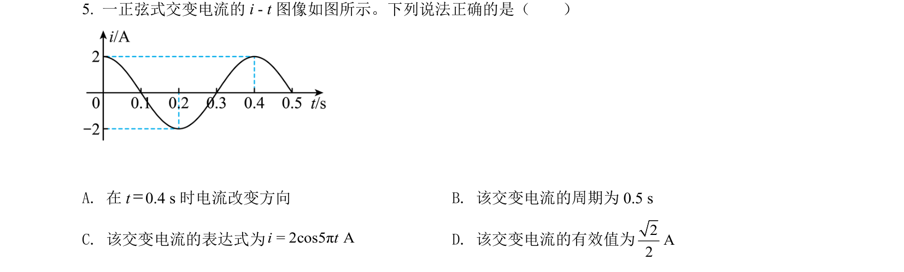
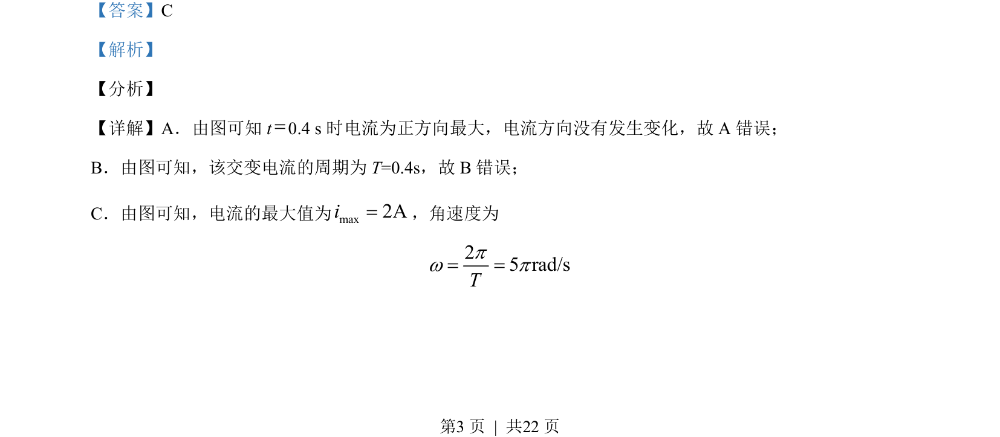
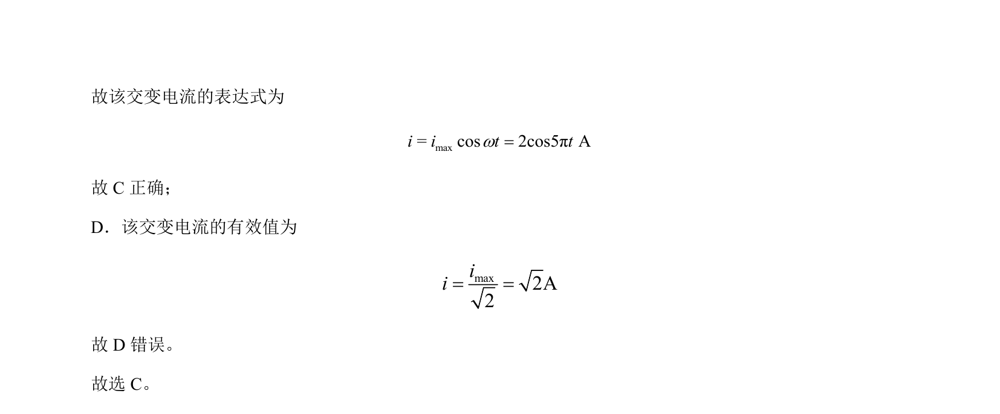

## 题面

## 摘要

该题考查根据交变电流图像判断周期、瞬时值、表达式和有效值。

## 关联考点

- [[789-交变电流|交变电流]]
- [[624-有效值|有效值]]
- [[周期与角速度]]
- [[瞬时值表达式]]

## 答案与解析

> 📄 原 PDF 第 3 页：`素材/真题/北京/2008-2024·（北京）物理高考真题/2021年高考物理试卷（北京）（解析卷）.pdf`
