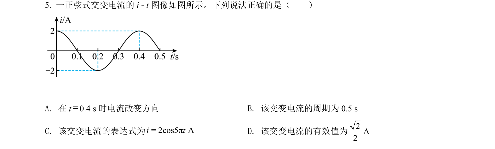
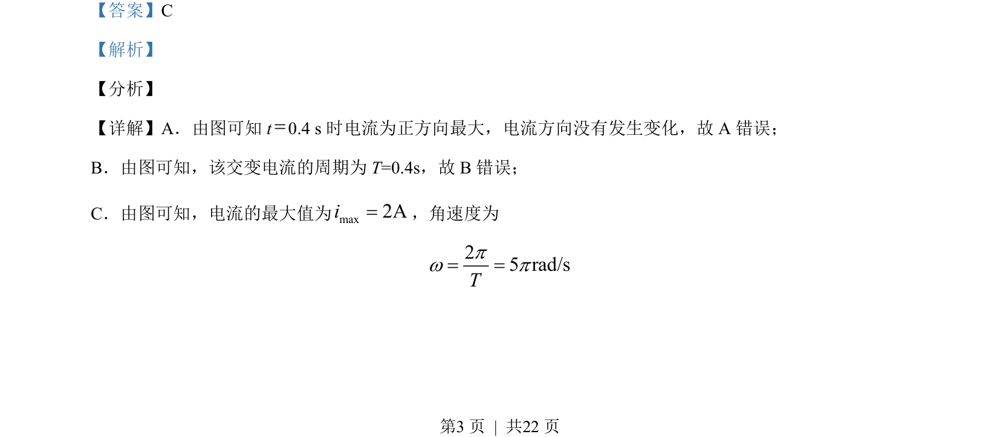
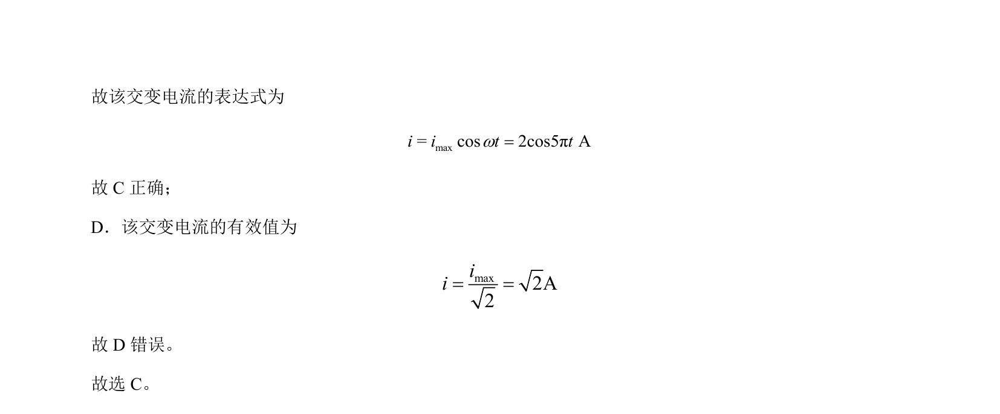

## 题面

## 摘要

该题考查根据交变电流图像判断周期、瞬时值、表达式和有效值。

## 关联考点

- [[789-交变电流|交变电流]]
- [[624-有效值|有效值]]
- [[周期与角速度]]
- [[瞬时值表达式]]

## 答案与解析

> 📄 原 PDF 第 3 页：`素材/真题/北京/2008-2024·（北京）物理高考真题/2021年高考物理试卷（北京）（解析卷）.pdf`

<!-- 题干文本-start -->
## 题干文本
5. 一正弦式交变电流的 i - t图像如图所示。下列说法正确的是（　　）
A. 在 t=0.4 s 时电流改变方向B. 该交变电流的周期为 0.5 s
C. 该交变电流的表达式为= 2cos5πAi tD. 该交变电流的有效值为2A2
<!-- 题干文本-end -->

<!-- 解析文本-start -->
## 解析文本
【答案】C
【解析】
【分析】
【详解】A．由图可知 t=0.4 s 时电流为正方向最大，电流方向没有发生变化，故 A 错误；
B．由图可知，该交变电流的周期为 T=0.4s，故 B错误；
C．由图可知，电流的最大值为max2Ai=，角速度为
25 rad/sTpw p= =
<!-- 解析文本-end -->
