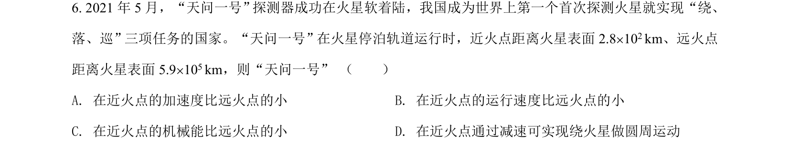
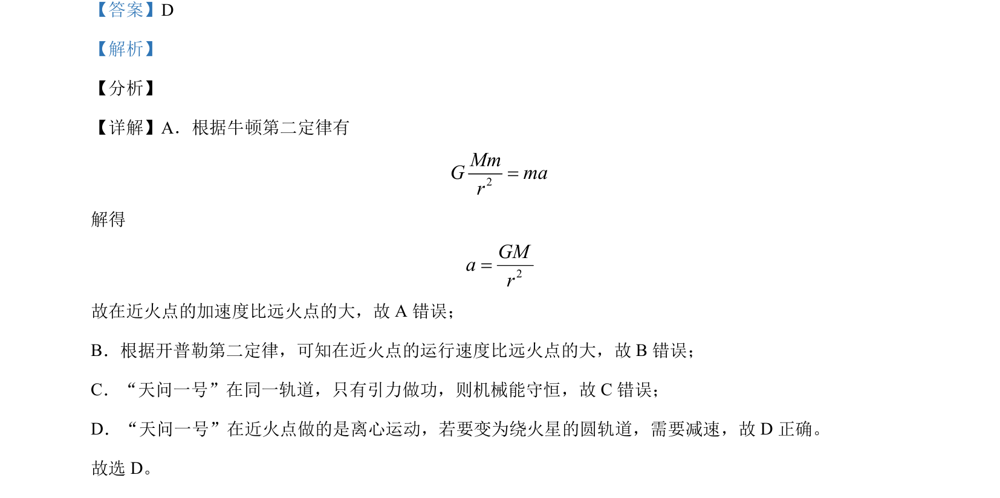

## 题面

## 摘要

考查天问一号在火星椭圆轨道上的加速度、速度、机械能及变轨问题。

## 关联考点

- [[267-开普勒第二定律|开普勒第二定律]]
- [[085-机械能守恒-初中|机械能守恒]]
- [[246-万有引力定律|万有引力定律]]
- [[卫星变轨]]

## 答案与解析

> 📄 原 PDF 第 4 页：`素材/真题/北京/2008-2024·（北京）物理高考真题/2021年高考物理试卷（北京）（解析卷）.pdf`
