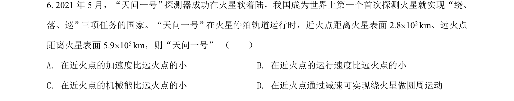
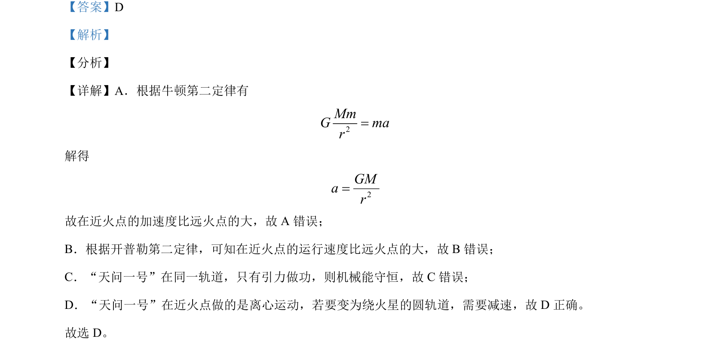

## 题面

## 摘要

考查天问一号在火星椭圆轨道上的加速度、速度、机械能及变轨问题。

## 关联考点

- [[267-开普勒第二定律|开普勒第二定律]]
- [[085-机械能守恒-初中|机械能守恒]]
- [[246-万有引力定律|万有引力定律]]
- [[卫星变轨]]

## 答案与解析

> 📄 原 PDF 第 4 页：`素材/真题/北京/2008-2024·（北京）物理高考真题/2021年高考物理试卷（北京）（解析卷）.pdf`

<!-- 题干文本-start -->
## 题干文本
6. 2021 年 5 月，“天问一号”探测器成功在火星软着陆，我国成为世界上第一个首次探测火星就实现“绕、
落、巡”三项任务的国家。“天问一号”在火星停泊轨道运行时，近火点距离火星表面2.8102 km、远火点
距离火星表面 5.9105 km，则“天问一号” （　　）
A. 在近火点的加速度比远火点的小B. 在近火点的运行速度比远火点的小
C. 在近火点的机械能比远火点的小D. 在近火点通过减速可实现绕火星做圆周运动
<!-- 题干文本-end -->

<!-- 解析文本-start -->
## 解析文本
【答案】D
【解析】
【分析】
【详解】A．根据牛顿第二定律有
2MmG mar=
解得
2GMar=
故在近火点的加速度比远火点的大，故 A 错误；
B．根据开普勒第二定律，可知在近火点的运行速度比远火点的大，故 B错误；
C．“天问一号”在同一轨道，只有引力做功，则机械能守恒，故 C错误；
D．“天问一号”在近火点做的是离心运动，若要变为绕火星的圆轨道，需要减速，故 D 正确。
故选 D。
<!-- 解析文本-end -->
