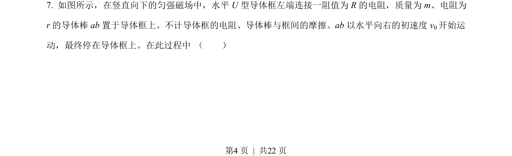
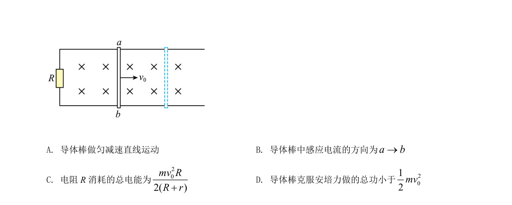
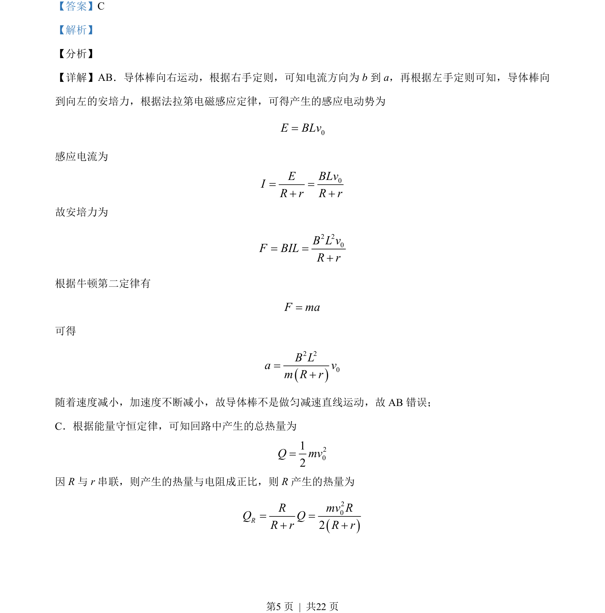
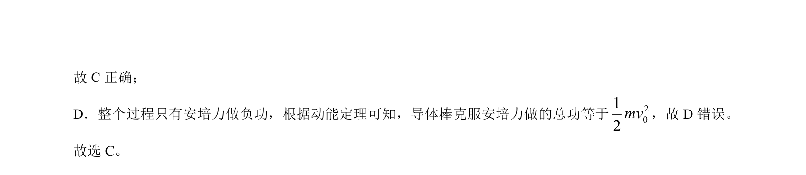

## 题面

## 摘要

导体棒在磁场中切割磁感线运动，分析电流方向、安培力、运动性质及能量转化。

## 关联考点

- [[175-电磁感应|电磁感应]]
- [[188-磁场对通电导体的作用|安培力]]
- [[197-能量守恒定律|能量守恒]]
- [[251-动能定理|动能定理]]

## 答案与解析

> 📄 原 PDF 第 4 页：`素材/真题/北京/2008-2024·（北京）物理高考真题/2021年高考物理试卷（北京）（解析卷）.pdf`
