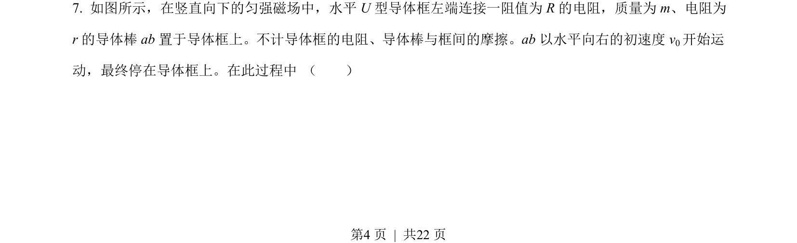
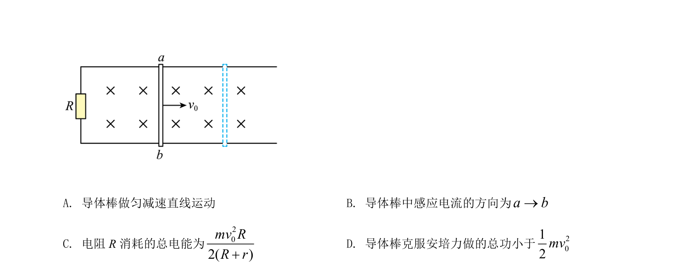
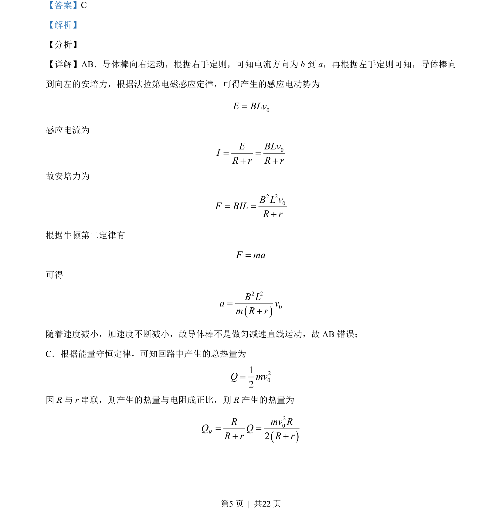
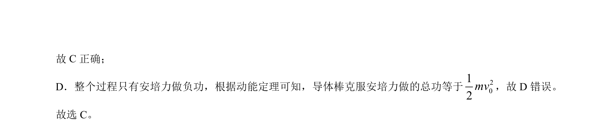

## 题面

## 摘要

导体棒在磁场中切割磁感线运动，分析电流方向、安培力、运动性质及能量转化。

## 关联考点

- [[175-电磁感应|电磁感应]]
- [[188-磁场对通电导体的作用|安培力]]
- [[197-能量守恒定律|能量守恒]]
- [[251-动能定理|动能定理]]

## 答案与解析

> 📄 原 PDF 第 4 页：`素材/真题/北京/2008-2024·（北京）物理高考真题/2021年高考物理试卷（北京）（解析卷）.pdf`

<!-- 题干文本-start -->
## 题干文本
7. 如图所示，在竖直向下的匀强磁场中，水平 U 型导体框左端连接一阻值为 R的电阻，质量为 m、电阻为
r 的导体棒 ab 置于导体框上。不计导体框的电阻、导体棒与框间的摩擦。ab 以水平向右的初速度 v0开始运
动，最终停在导体框上。在此过程中 （　　）
<!-- 题干文本-end -->

<!-- 解析文本-start -->
## 解析文本

<!-- 解析文本-end -->
