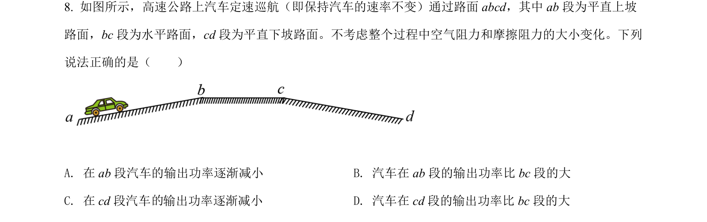
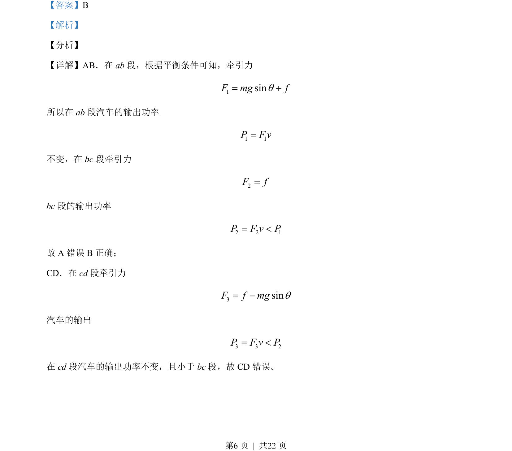

## 题面

## 摘要

汽车在不同路段牵引力与输出功率的变化分析，涉及平衡条件和功率计算。

## 关联考点

- [[063-功率|功率]]
- [[604-平衡条件|平衡条件]]
- [[牵引力]]

## 答案与解析

> 📄 原 PDF 第 6 页：`素材/真题/北京/2008-2024·（北京）物理高考真题/2021年高考物理试卷（北京）（解析卷）.pdf`

<!-- 题干文本-start -->
## 题干文本
8. 如图所示，高速公路上汽车定速巡航（即保持汽车的速率不变）通过路面 abcd，其中 ab 段为平直上坡
路面，bc段为水平路面，cd段为平直下坡路面。不考虑整个过程中空气阻力和摩擦阻力的大小变化。下列
说法正确的是（　　）
A. 在 ab 段汽车的输出功率逐渐减小B. 汽车在 ab 段的输出功率比 bc段的大
C. 在 cd段汽车 输出功率逐渐减小D. 汽车在 cd段的输出功率比 bc段的大
<!-- 题干文本-end -->

<!-- 解析文本-start -->
## 解析文本
【答案】B
【解析】
【分析】
【详解】AB．在 ab 段，根据平衡条件可知，牵引力
1sinFmgf=+
所以在 ab 段汽车的输出功率
1 1P F v=
不变，在 bc段牵引力
2F f=
bc段的输出功率
2 2 1P F v P= <
故 A 错误 B正确；
CD．在 cd段牵引力
3sinF f mg= -
汽车的输出
3 3 2P F v P= <
在 cd段汽车的输出功率不变，且小于 bc段，故 CD 错误。
的
<!-- 解析文本-end -->
