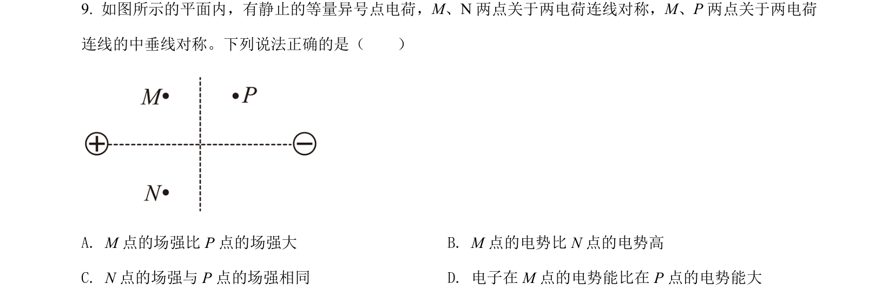
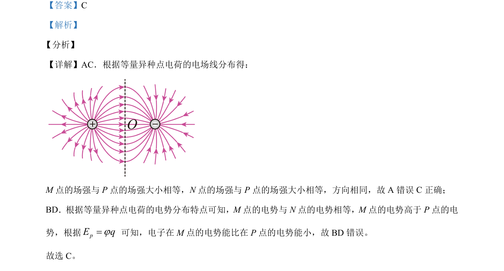

## 题面

## 摘要

等量异种点电荷电场中比较M、N、P三点的场强大小、方向及电势、电势能。

## 关联考点

- [[等量异种点电荷电场]]
- [[277-电场强度|电场强度]]
- [[308-电势|电势]]
- [[276-电势能|电势能]]

## 答案与解析

> 📄 原 PDF 第 7 页：`素材/真题/北京/2008-2024·（北京）物理高考真题/2021年高考物理试卷（北京）（解析卷）.pdf`
