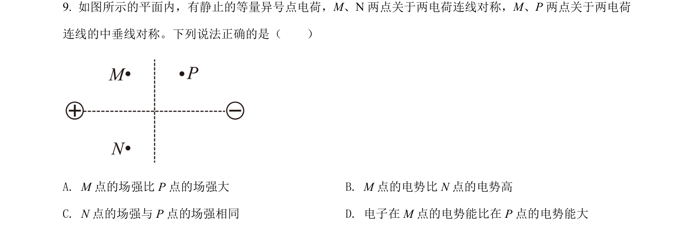
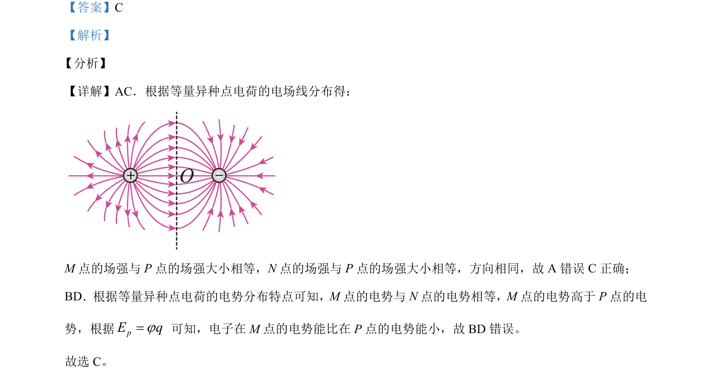

## 题面

## 摘要

等量异种点电荷电场中比较M、N、P三点的场强大小、方向及电势、电势能。

## 关联考点

- [[等量异种点电荷电场]]
- [[277-电场强度|电场强度]]
- [[308-电势|电势]]
- [[276-电势能|电势能]]

## 答案与解析

> 📄 原 PDF 第 7 页：`素材/真题/北京/2008-2024·（北京）物理高考真题/2021年高考物理试卷（北京）（解析卷）.pdf`

<!-- 题干文本-start -->
## 题干文本
9. 如图所示的平面内，有静止的等量异号点电荷，M、N 两点关于两电荷连线对称，M、P两点关于两电荷
连线的中垂线对称。下列说法正确的是（　　）
A. M 点的场强比 P点的场强大B. M 点的电势比 N点的电势高
C. N点的场强与 P点的场强相同D. 电子在 M 点的电势能比在 P点的电势能大
<!-- 题干文本-end -->

<!-- 解析文本-start -->
## 解析文本
【答案】C
【解析】
分析】
【详解】AC．根据等量异种点电荷的电场线分布得：
M 点的场强与 P点的场强大小相等，N点的场强与 P点的场强大小相等，方向相同，故 A 错误 C正确；
BD．根据等量异种点电荷的电势分布特点可知，M 点的电势与 N点的电势相等，M 点的电势高于 P点的电
势，根据pE qj= 可知，电子在 M 点的电势能比在 P点的电势能小，故 BD 错误。
故选 C。
<!-- 解析文本-end -->
