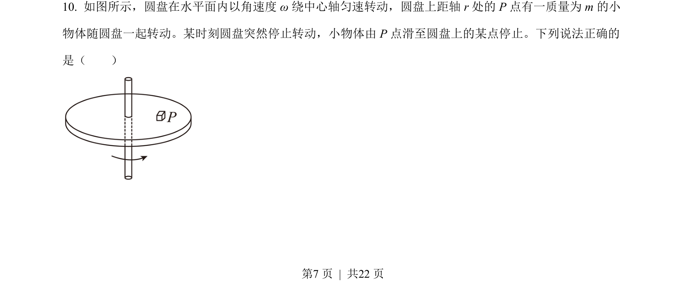
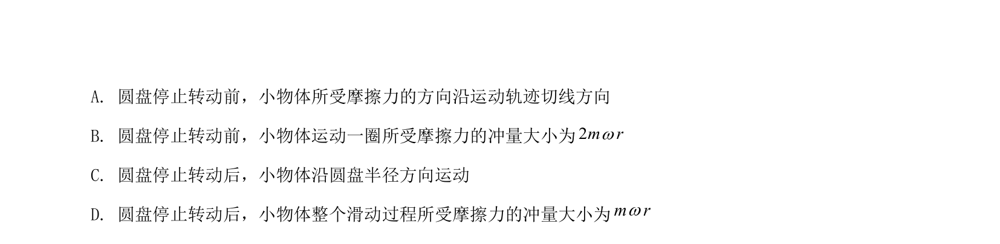
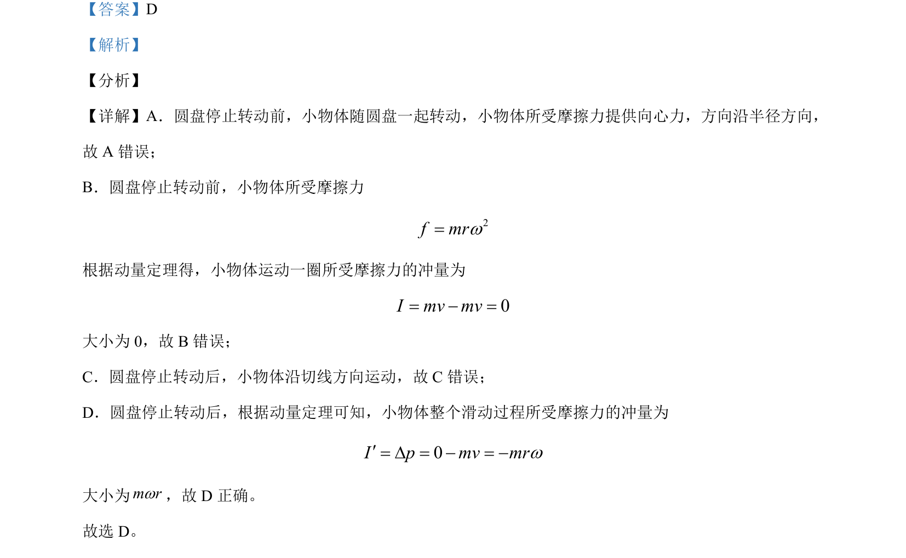

## 题面

## 摘要

圆盘上物体随盘转动停止前后的受力、运动及摩擦力的冲量分析

## 关联考点

- [[256-向心力|向心力]]
- [[081-摩擦力|摩擦力]]
- [[349-动量定理|动量定理]]
- [[345-冲量|冲量]]

## 答案与解析

> 📄 原 PDF 第 7 页：`素材/真题/北京/2008-2024·（北京）物理高考真题/2021年高考物理试卷（北京）（解析卷）.pdf`
