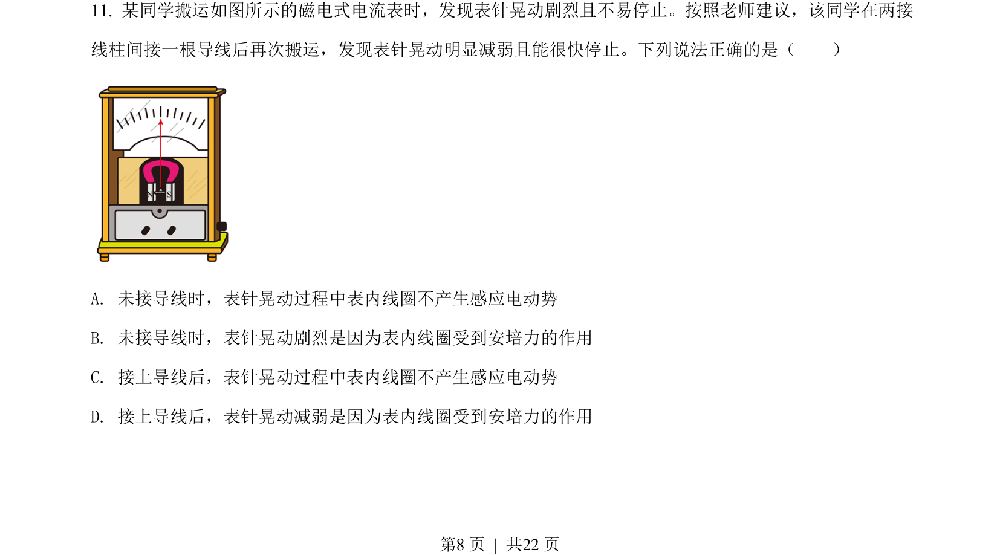
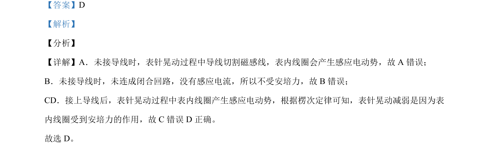

## 题面

## 摘要

考查电表指针晃动时是否产生感应电动势及安培力，结合楞次定律分析。

## 关联考点

- [[175-电磁感应|电磁感应]]
- [[387-感应电动势|感应电动势]]
- [[188-磁场对通电导体的作用|安培力]]
- [[393-楞次定律|楞次定律]]

## 答案与解析

> 📄 原 PDF 第 8 页：`素材/真题/北京/2008-2024·（北京）物理高考真题/2021年高考物理试卷（北京）（解析卷）.pdf`
