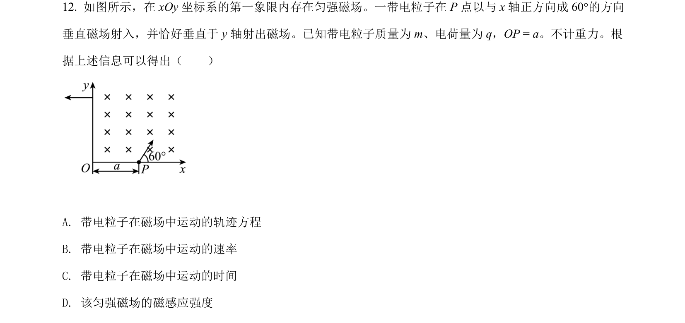
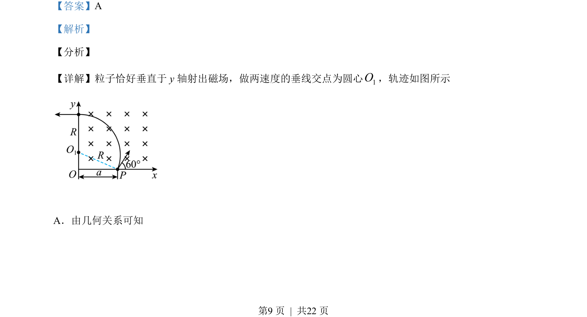
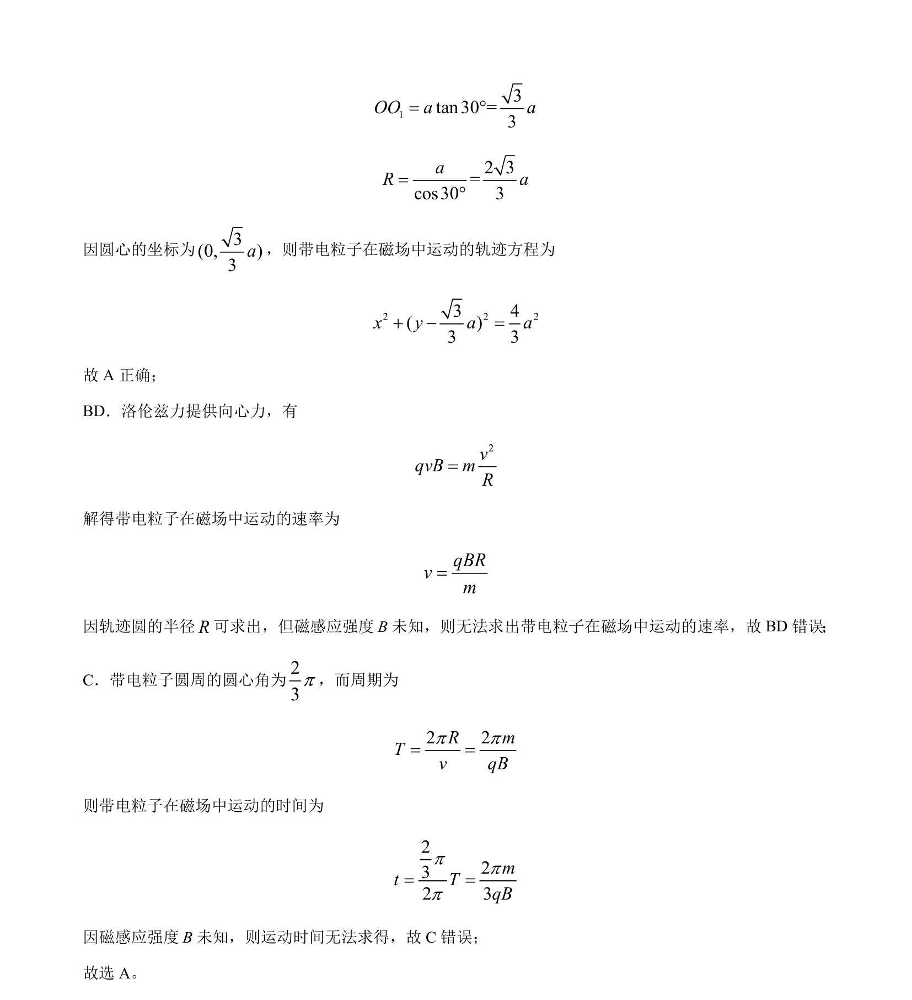

## 题面

## 摘要

带电粒子在匀强磁场中偏转，由几何关系求轨迹方程，分析速率和时间无法求解的原因

## 关联考点

- [[595-带电粒子在匀强磁场中的运动|带电粒子在匀强磁场中的运动]]
- [[649-洛伦兹力提供向心力|洛伦兹力提供向心力]]
- [[376-圆锥曲线轨迹问题|轨迹方程]]
- [[759-周期公式|周期公式]]

## 答案与解析

> 📄 原 PDF 第 9 页：`素材/真题/北京/2008-2024·（北京）物理高考真题/2021年高考物理试卷（北京）（解析卷）.pdf`
