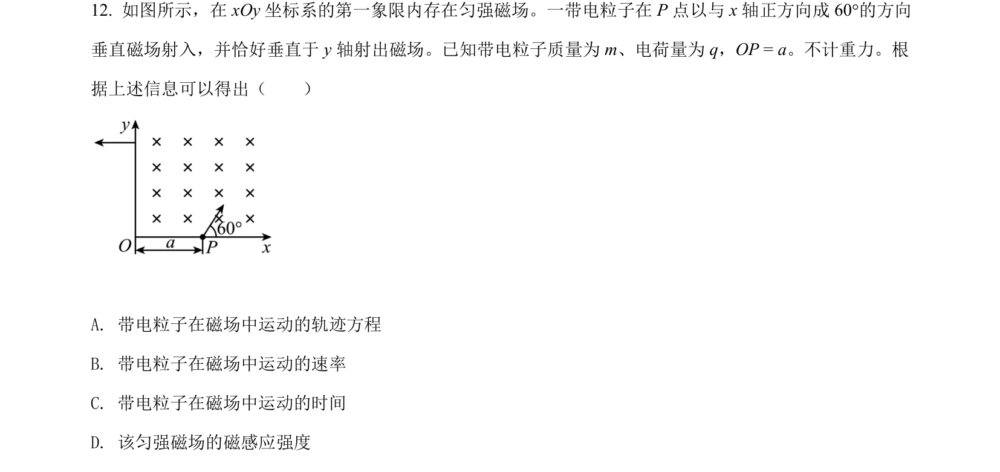
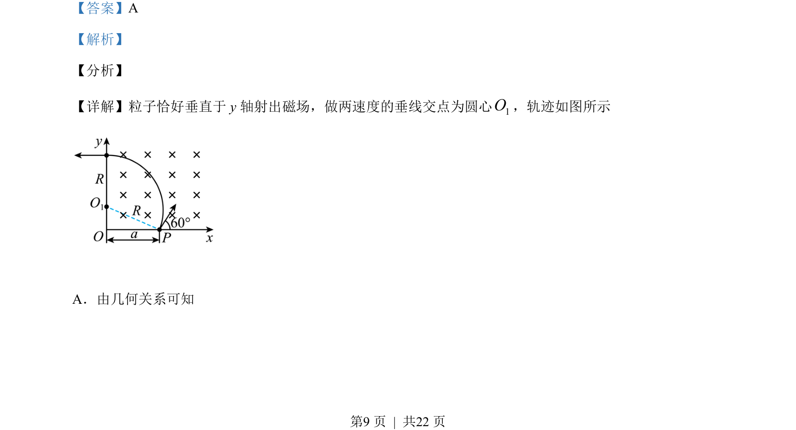
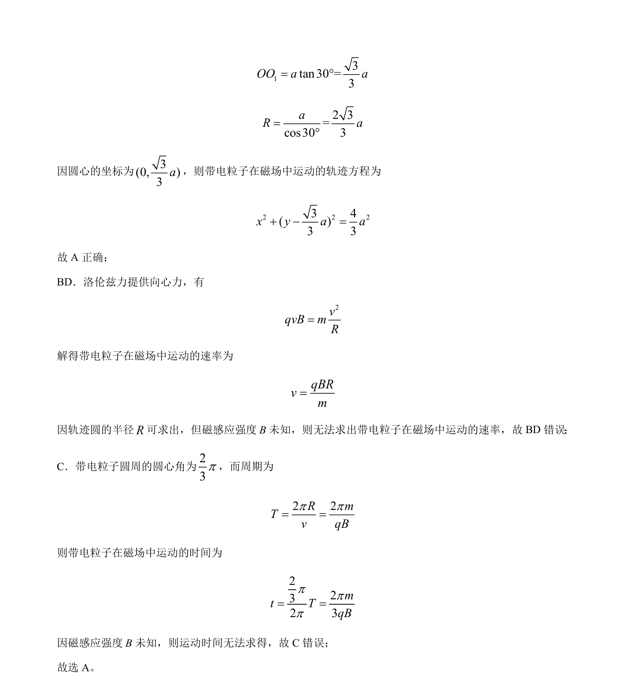

## 题面

## 摘要

带电粒子在匀强磁场中偏转，由几何关系求轨迹方程，分析速率和时间无法求解的原因

## 关联考点

- [[595-带电粒子在匀强磁场中的运动|带电粒子在匀强磁场中的运动]]
- [[649-洛伦兹力提供向心力|洛伦兹力提供向心力]]
- [[376-圆锥曲线轨迹问题|轨迹方程]]
- [[759-周期公式|周期公式]]

## 答案与解析

> 📄 原 PDF 第 9 页：`素材/真题/北京/2008-2024·（北京）物理高考真题/2021年高考物理试卷（北京）（解析卷）.pdf`

<!-- 题干文本-start -->
## 题干文本
12. 如图所示，在 xOy坐标系的第一象限内存在匀强磁场。一带电粒子在 P点以与 x轴正方向成 60的方向
垂直磁场射入，并恰好垂直于 y轴射出磁场。已知带电粒子质量为 m、电荷量为 q，OP = a。不计重力。根
据上述信息可以得出（　　）
A. 带电粒子在磁场中运动的轨迹方程
B. 带电粒子在磁场中运动的速率
C. 带电粒子在磁场中运动的时间
D. 该匀强磁场的磁感应强度
<!-- 题干文本-end -->

<!-- 解析文本-start -->
## 解析文本
【答案】A
【解析】
【分析】
【详解】粒子恰好垂直于 y轴射出磁场，做两速度的垂线交点为圆心1O，轨迹如图所示
A．由几何关系可知
<!-- 解析文本-end -->
