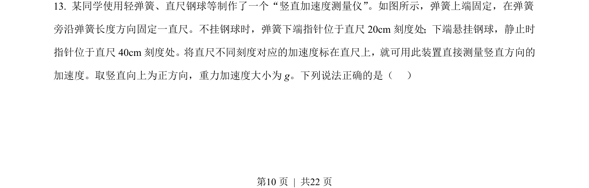
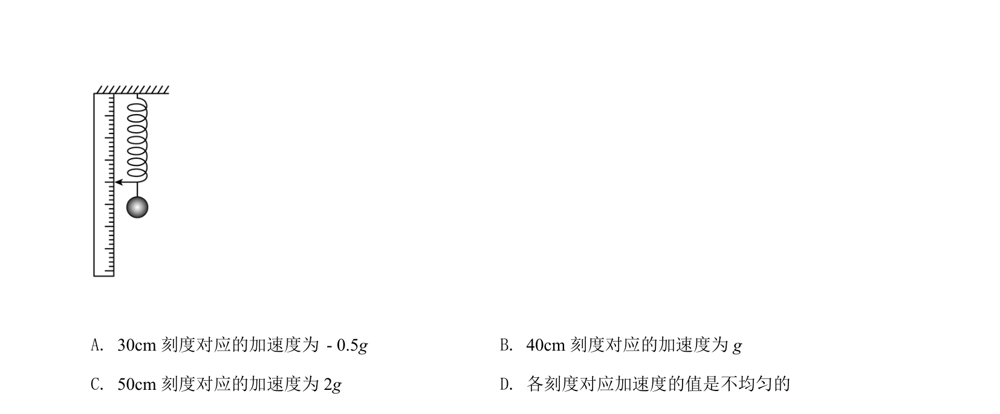
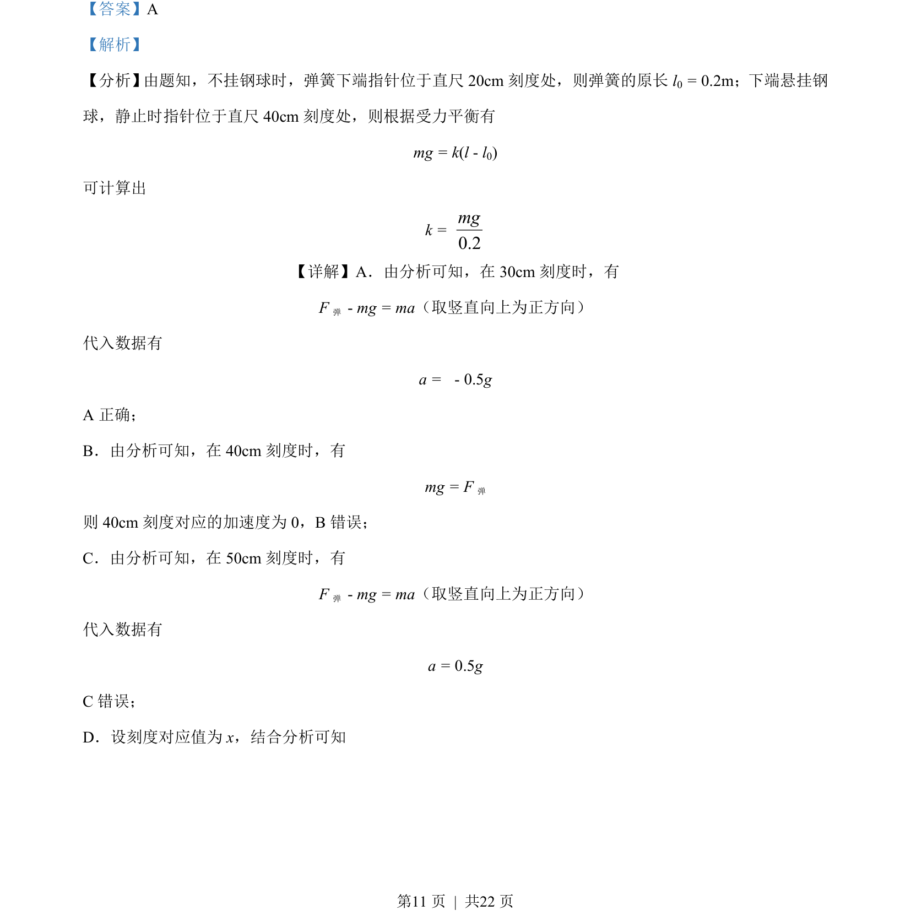
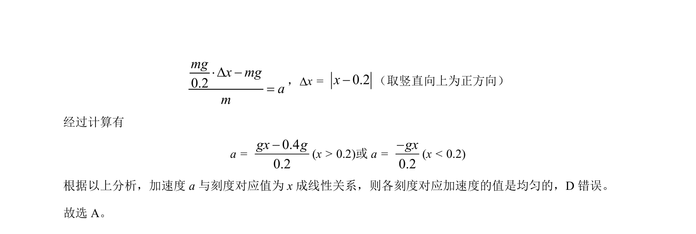

## 题面

## 摘要

通过弹簧悬挂钢球，结合胡克定律和牛顿第二定律求解不同刻度对应的加速度，并判断加速度与刻度关系的线性均匀性。

## 关联考点

- [[233-胡克定律|胡克定律]]
- [[229-牛顿第二定律|牛顿第二定律]]
- [[460-受力分析|受力分析]]
- [[604-平衡条件|平衡条件]]

## 答案与解析

> 📄 原 PDF 第 10 页：`素材/真题/北京/2008-2024·（北京）物理高考真题/2021年高考物理试卷（北京）（解析卷）.pdf`
