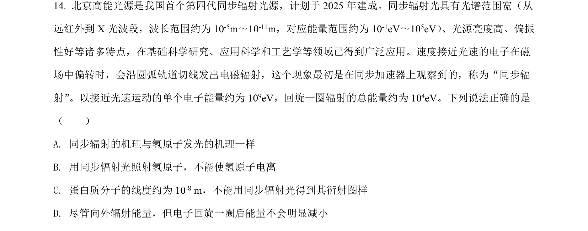
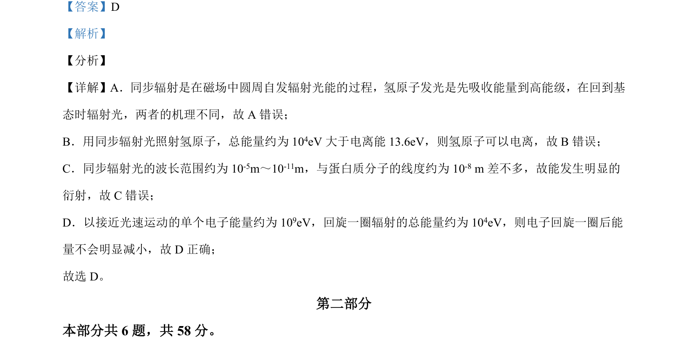

## 题面

## 摘要

考查同步辐射与氢原子发光机理、电离条件、衍射条件及电子能量变化的辨析。

## 关联考点

- [[同步辐射]]
- [[759-氢原子能级跃迁|氢原子能级跃迁]]
- [[390-电离能|电离能]]
- [[衍射条件]]
- [[能量变化]]

## 答案与解析

> 📄 原 PDF 第 12 页：`素材/真题/北京/2008-2024·（北京）物理高考真题/2021年高考物理试卷（北京）（解析卷）.pdf`
