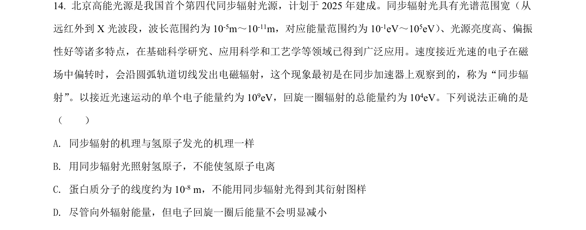
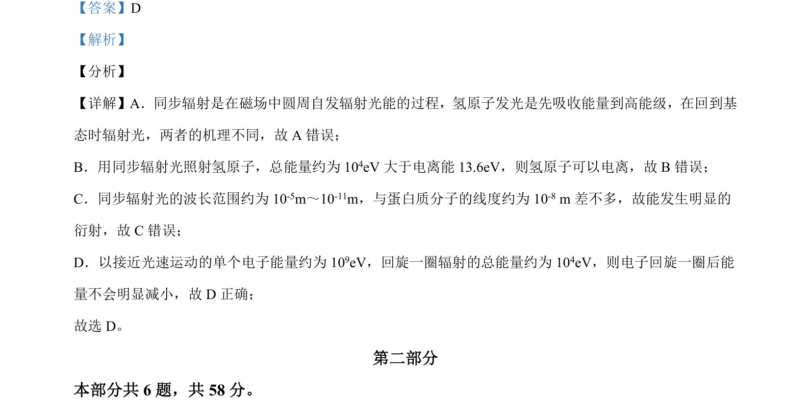

## 题面

## 摘要

考查同步辐射与氢原子发光机理、电离条件、衍射条件及电子能量变化的辨析。

## 关联考点

- [[同步辐射]]
- [[758-氢原子能级跃迁|氢原子能级跃迁]]
- [[390-电离能|电离能]]
- [[衍射条件]]
- [[能量变化]]

## 答案与解析

> 📄 原 PDF 第 12 页：`素材/真题/北京/2008-2024·（北京）物理高考真题/2021年高考物理试卷（北京）（解析卷）.pdf`

<!-- 题干文本-start -->
## 题干文本
14. 北京高能光源是我国首个第四代同步辐射光源，计划于 2025 年建成。同步辐射光具有光谱范围宽（从
远红外到 X 光波段，波长范围约为 10-5m～10-11m，对应能量范围约为 10-1eV～105eV） 、光源亮度高、偏振
性好等诸多特点，在基础科学研究、应用科学和工艺学等领域已得到广泛应用。速度接近光速的电子在磁
场中偏转时，会沿圆弧轨道切线发出电磁辐射，这个现象最初是在同步加速器上观察到的，称为“同步辐
射”。以接近光速运动的单个电子能量约为109eV，回旋一圈辐射的总能量约为 104eV。下列说法正确的是
（　　）
A. 同步辐射的机理与氢原子发光的机理一样
B. 用同步辐射光照射氢原子，不能使氢原子电离
C. 蛋白质分子的线度约为 10-8 m，不能用同步辐射光得到其衍射图样
D. 尽管向外辐射能量，但电子回旋一圈后能量不会明显减小
<!-- 题干文本-end -->

<!-- 解析文本-start -->
## 解析文本
【答案】D
【解析】
【分析】
【详解】A．同步辐射是在磁场中圆周自发辐射光能的过程，氢原子发光是先吸收能量到高能级，在回到基
态时辐射光，两者的机理不同，故 A 错误；
B．用同步辐射光照射氢原子，总能量约为 104eV大于电离能 13.6eV，则氢原子可以电离，故 B错误；
C．同步辐射光的波长范围约为 10-5m～10-11m，与蛋白质分子的线度约为 10-8 m差不多，故能发生明显的
衍射，故 C错误；
D．以接近光速运动的单个电子能量约为 109eV，回旋一圈辐射的总能量约为 104eV，则电子回旋一圈后能
量不会明显减小，故 D 正确；
故选 D。
第二部分
本部分共 6 题，共 58 分。
<!-- 解析文本-end -->
