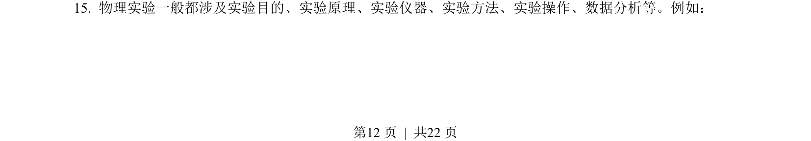
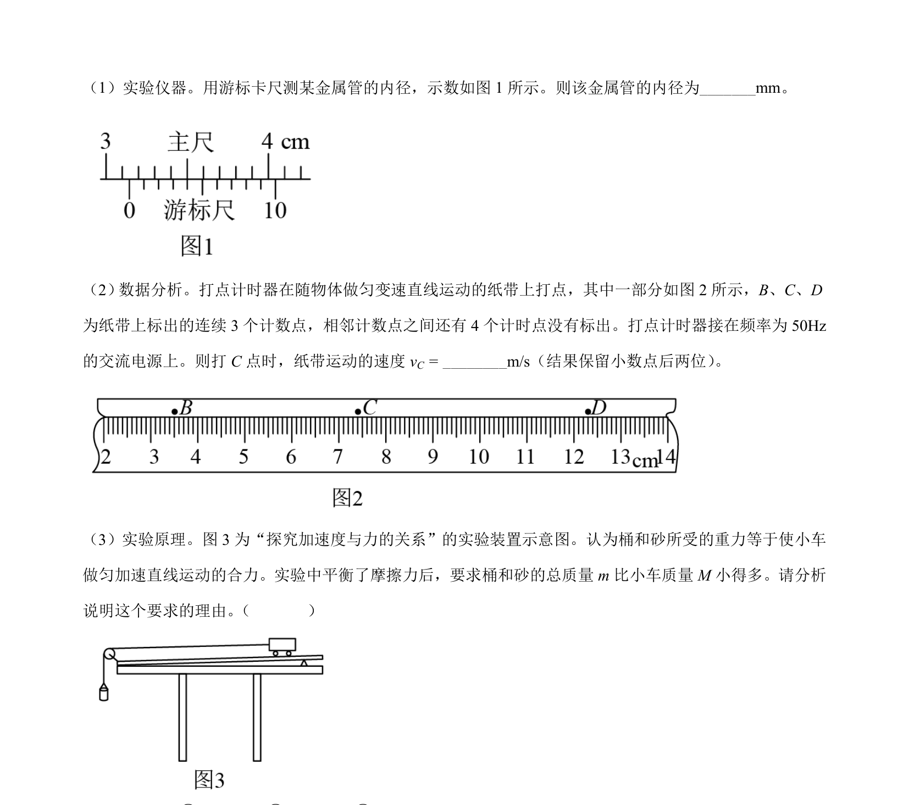
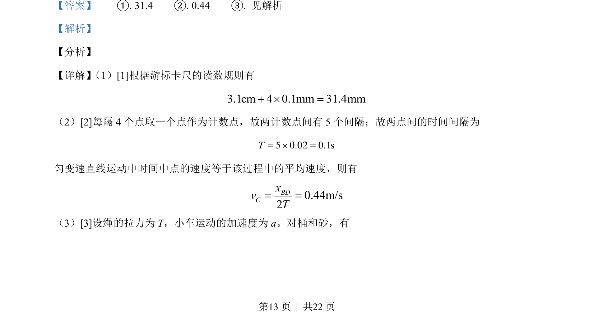
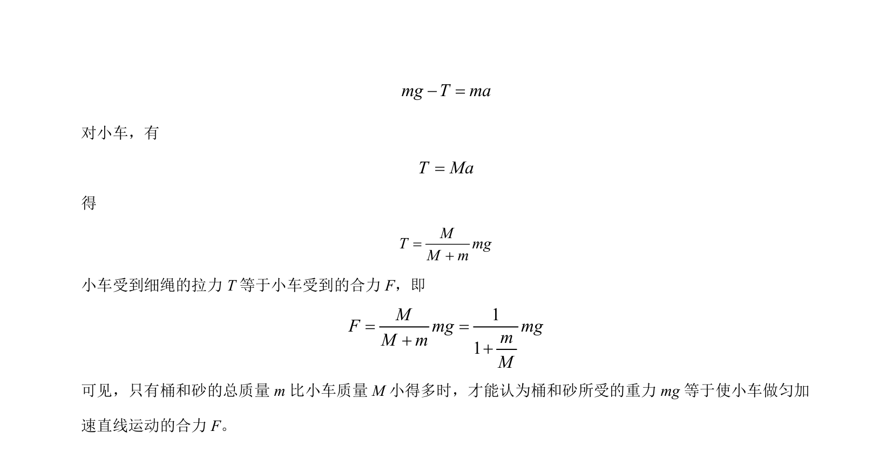

## 题面

## 摘要

考查游标卡尺读数、打点计时器测速度及牛顿第二定律实验中近似条件。

## 关联考点

- [[游标卡尺读数]]
- [[756-打点计时器|打点计时器]]
- [[匀变速直线运动速度]]
- [[牛顿第二定律实验]]

## 答案与解析

> 📄 原 PDF 第 12 页：`素材/真题/北京/2008-2024·（北京）物理高考真题/2021年高考物理试卷（北京）（解析卷）.pdf`
