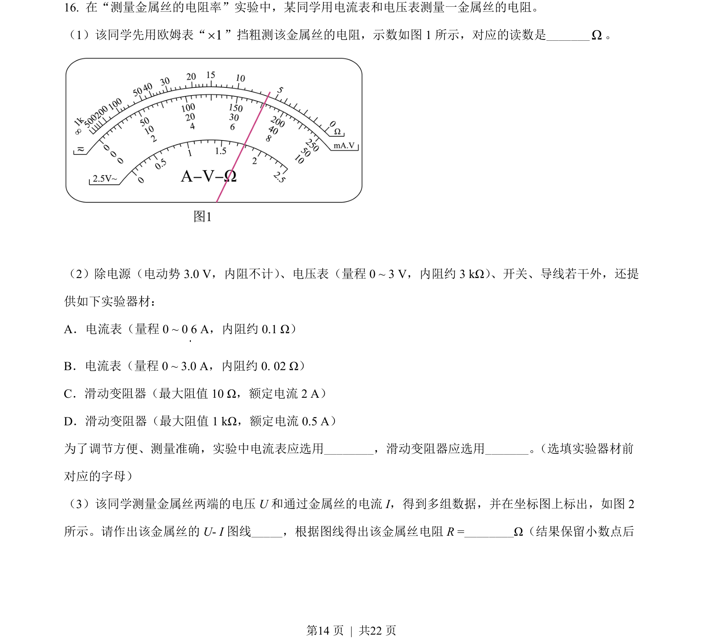
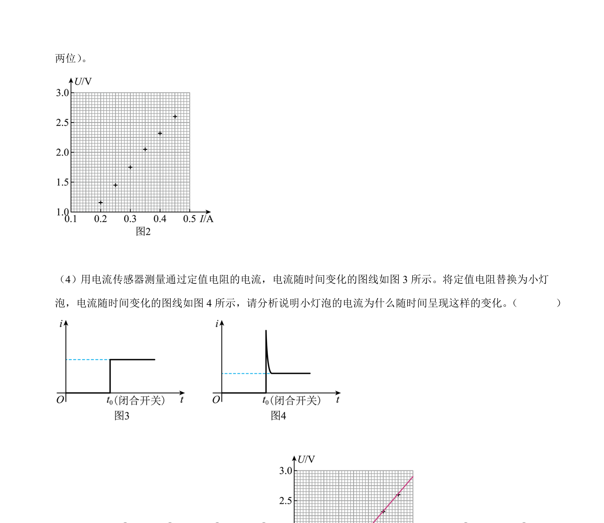
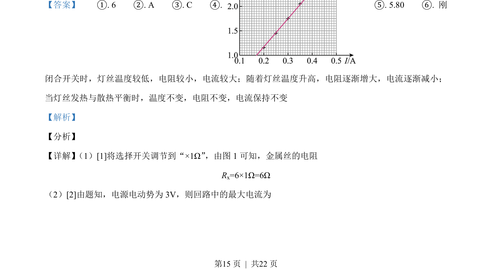
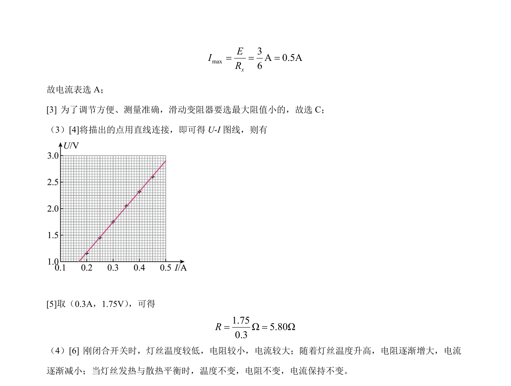

## 题面

## 摘要

考查多用电表电阻测量、电路器材选择、U-I图线绘制及灯丝电阻随温度变化分析。

## 关联考点

- [[772-电阻测量|电阻测量]]
- [[695-电路实验|电路实验]]
- [[141-欧姆定律-初中|欧姆定律]]
- [[温度对电阻的影响]]

## 答案与解析

> 📄 原 PDF 第 14 页：`素材/真题/北京/2008-2024·（北京）物理高考真题/2021年高考物理试卷（北京）（解析卷）.pdf`
