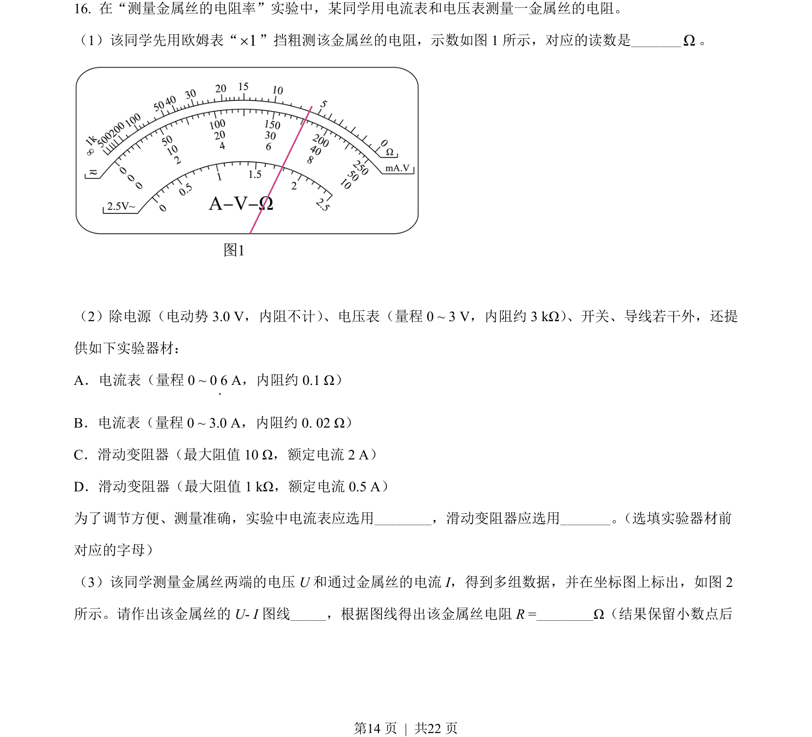
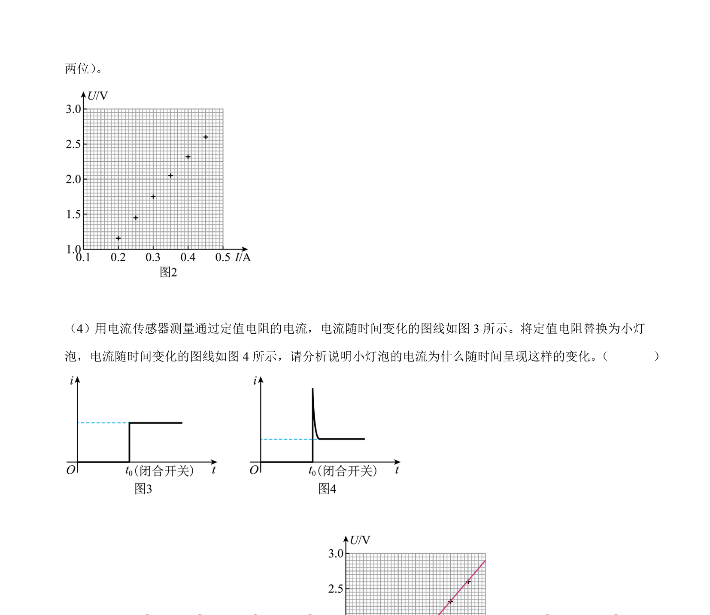
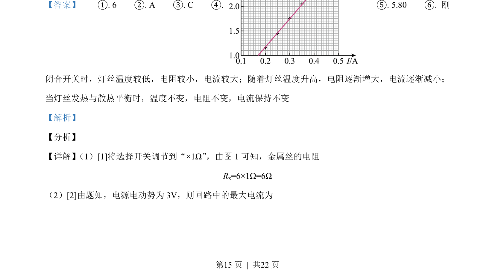
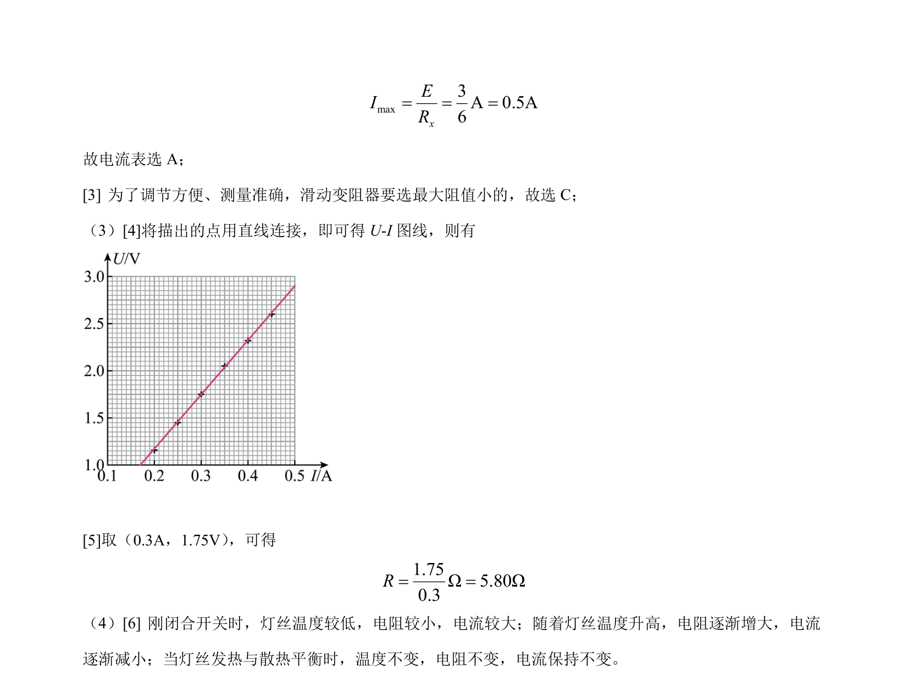

## 题面

## 摘要

考查多用电表电阻测量、电路器材选择、U-I图线绘制及灯丝电阻随温度变化分析。

## 关联考点

- [[772-电阻测量|电阻测量]]
- [[695-电路实验|电路实验]]
- [[141-欧姆定律-初中|欧姆定律]]
- [[温度对电阻的影响]]

## 答案与解析

> 📄 原 PDF 第 14 页：`素材/真题/北京/2008-2024·（北京）物理高考真题/2021年高考物理试卷（北京）（解析卷）.pdf`

<!-- 题干文本-start -->
## 题干文本
16. 在“测量金属丝的电阻率”实验中，某同学用电流表和电压表测量一金属丝的电阻。
（1）该同学先用欧姆表“1×”挡粗测该金属丝的电阻，示数如图 1 所示，对应的读数是_______Ω。
（2）除电源（电动势 3.0 V，内阻不计） 、电压表（量程0 ~ 3 V，内阻约 3 kΩ） 、开关、导线若干外，还提
供如下实验器材：
A．电流表（量程 0 ~ 0 6 A，内阻约 0.1 Ω）
B．电流表（量程 0 ~ 3.0 A，内阻约 0. 02 Ω）
C．滑动变阻器（最大阻值 10 Ω，额定电流 2 A）
D．滑动变阻器（最大阻值 1 kΩ，额定电流 0.5 A）
为了调节方便、测量准确，实验中电流表应选用________，滑动变阻器应选用_______。 （选填实验器材前
对应的字母）
（3）该同学测量金属丝两端的电压 U 和通过金属丝的电流 I，得到多组数据，并在坐标图上标出，如图 2
所示。请作出该金属丝的 U- I 图线_____，根据图线得出该金属丝电阻 R =________Ω（结果保留小数点后
.
<!-- 题干文本-end -->

<!-- 解析文本-start -->
## 解析文本

<!-- 解析文本-end -->
