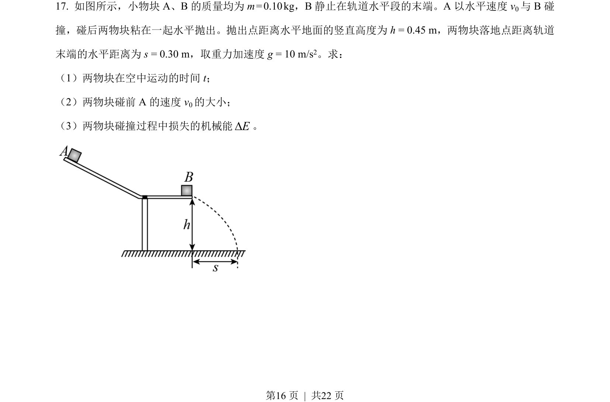
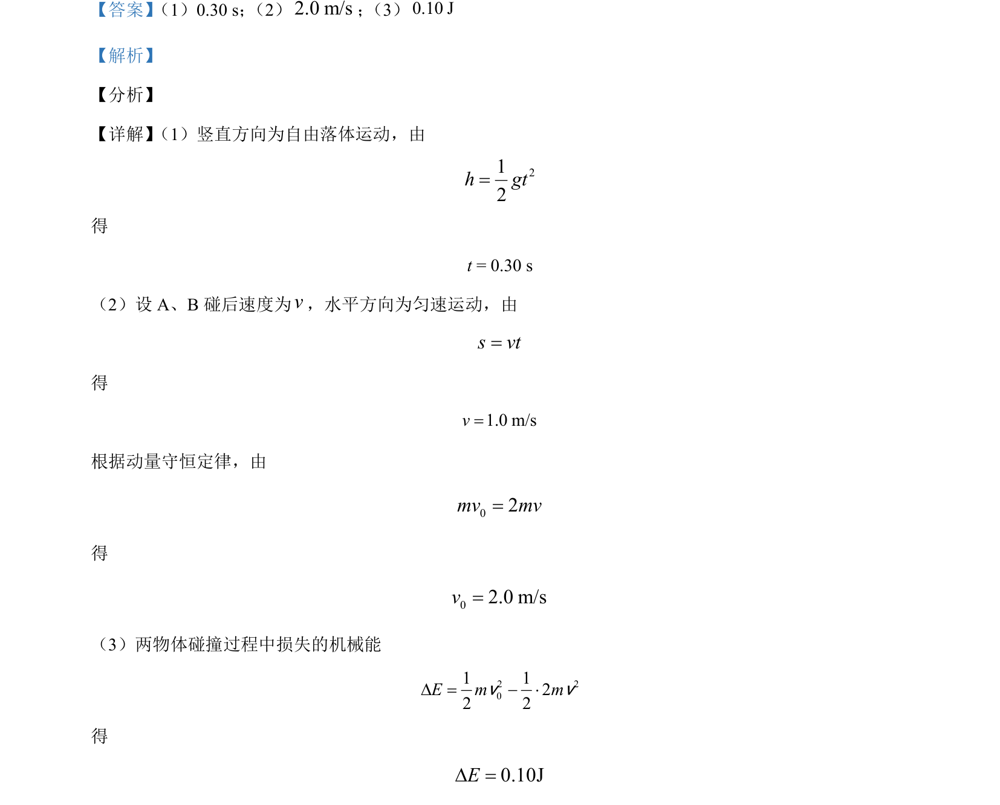

## 题面

## 摘要

物体平抛运动与水平碰撞结合，计算下落时间、碰后速度和能量损失。

## 关联考点

- [[234-自由落体运动|自由落体运动]]
- [[347-动量守恒定律|动量守恒定律]]
- [[197-能量守恒定律|能量守恒]]
- [[261-平抛运动|平抛运动]]

## 答案与解析

> 📄 原 PDF 第 16 页：`素材/真题/北京/2008-2024·（北京）物理高考真题/2021年高考物理试卷（北京）（解析卷）.pdf`
