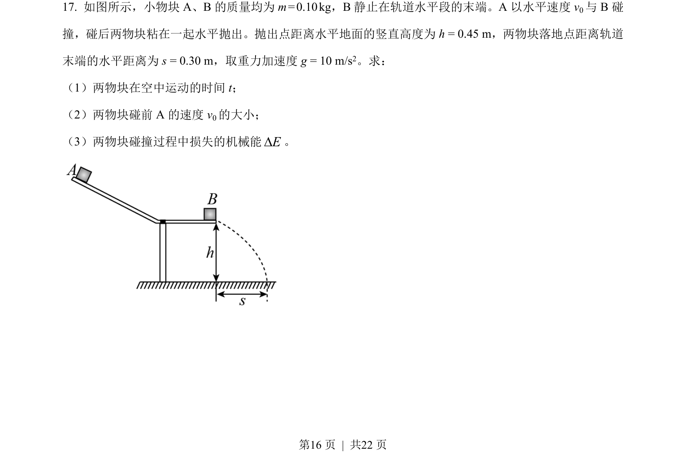
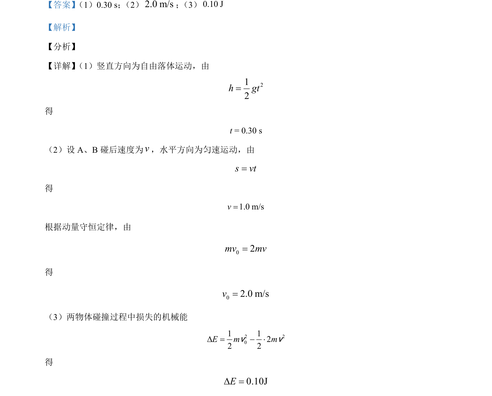

## 题面

## 摘要

物体平抛运动与水平碰撞结合，计算下落时间、碰后速度和能量损失。

## 关联考点

- [[234-自由落体运动|自由落体运动]]
- [[347-动量守恒定律|动量守恒定律]]
- [[197-能量守恒定律|能量守恒]]
- [[261-平抛运动|平抛运动]]

## 答案与解析

> 📄 原 PDF 第 16 页：`素材/真题/北京/2008-2024·（北京）物理高考真题/2021年高考物理试卷（北京）（解析卷）.pdf`

<!-- 题干文本-start -->
## 题干文本
17. 如图所示，小物块 A、B的质量均为 m = 0.10 kg，B静止在轨道水平段的末端。A 以水平速度 v0与 B碰
撞，碰后两物块粘在一起水平抛出。抛出点距离水平地面的竖直高度为 h = 0.45 m，两物块落地点距离轨道
末端的水平距离为 s = 0.30 m，取重力加速度 g = 10 m/s2。求：
（1）两物块在空中运动的时间 t；
（2）两物块碰前 A 的速度 v0的大小；
（3）两物块碰撞过程中损失的机械能ED。
<!-- 题干文本-end -->

<!-- 解析文本-start -->
## 解析文本

<!-- 解析文本-end -->
