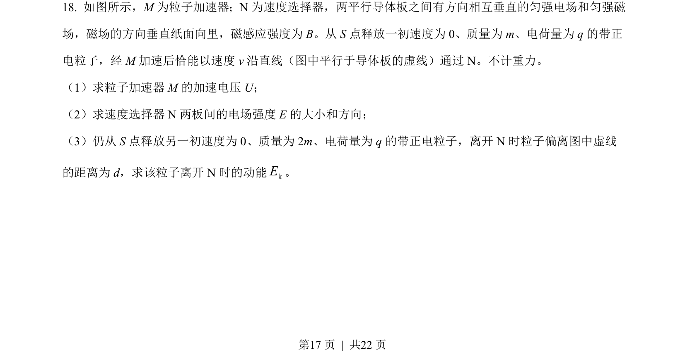
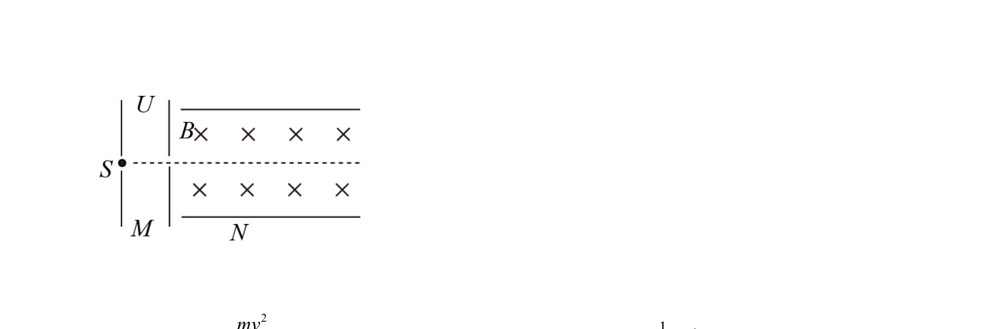
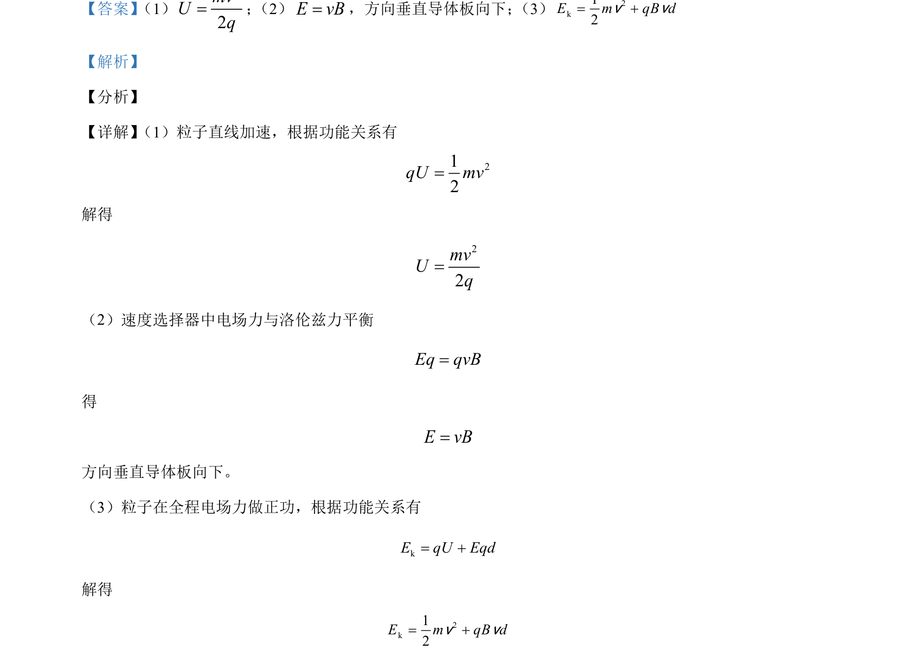

## 题面

## 摘要

粒子在电场中加速后进入速度选择器，通过功能关系和受力平衡求速度与场强。

## 关联考点

- [[251-动能定理|动能定理]]
- [[302-带电粒子复合场运动|速度选择器]]
- [[672-电场力|电场力]]
- [[304-洛伦兹力|洛伦兹力]]

## 答案与解析

> 📄 原 PDF 第 17 页：`素材/真题/北京/2008-2024·（北京）物理高考真题/2021年高考物理试卷（北京）（解析卷）.pdf`
