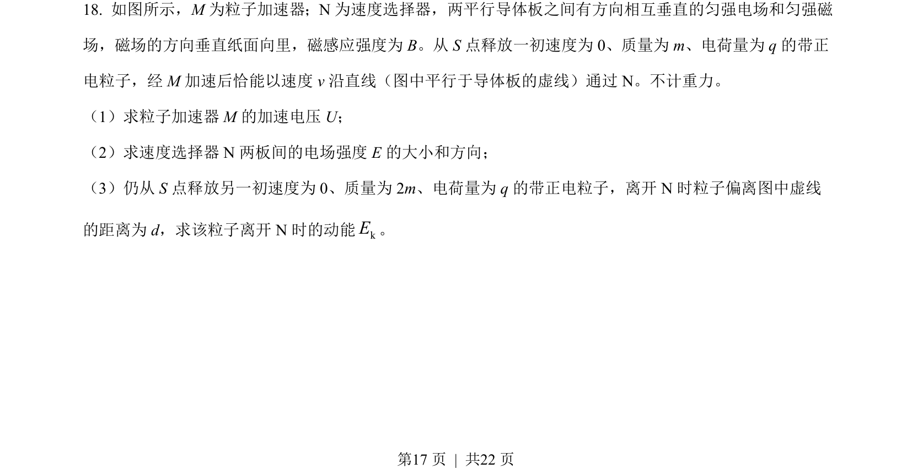
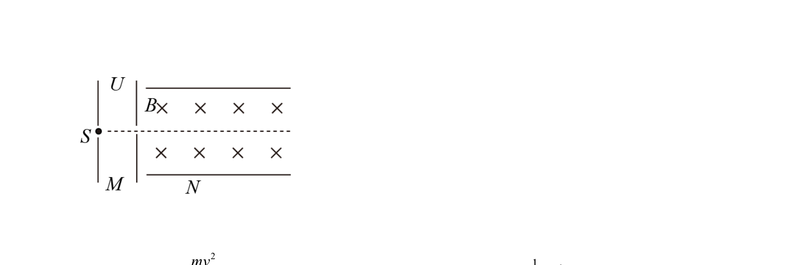
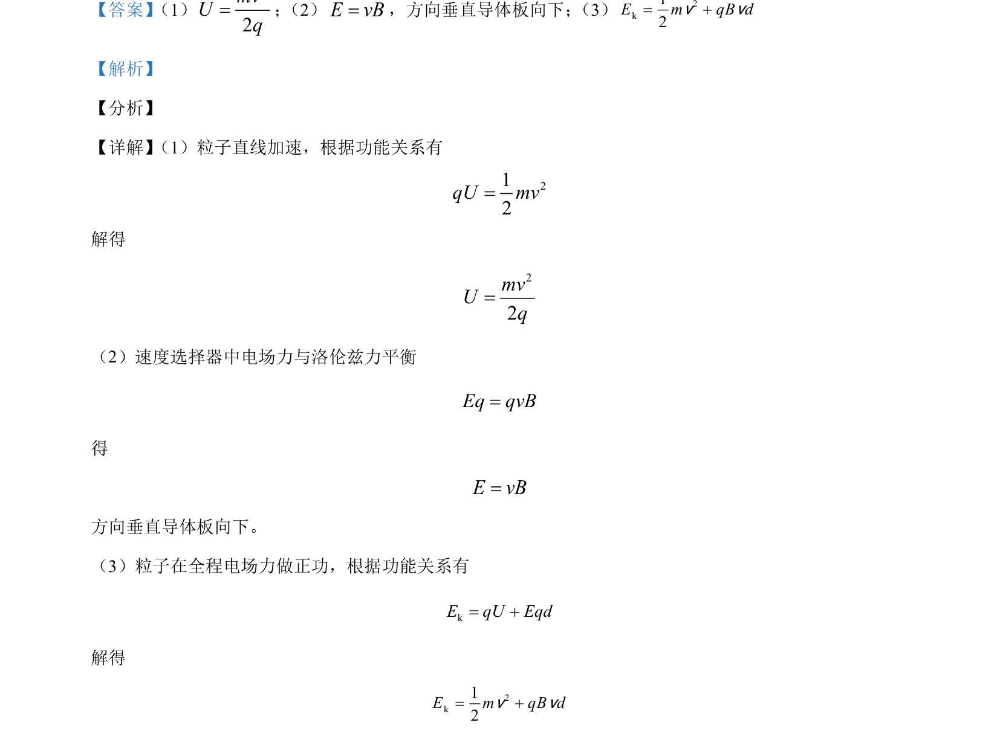

## 题面

## 摘要

粒子在电场中加速后进入速度选择器，通过功能关系和受力平衡求速度与场强。

## 关联考点

- [[251-动能定理|动能定理]]
- [[302-带电粒子复合场运动|速度选择器]]
- [[672-电场力|电场力]]
- [[304-洛伦兹力|洛伦兹力]]

## 答案与解析

> 📄 原 PDF 第 17 页：`素材/真题/北京/2008-2024·（北京）物理高考真题/2021年高考物理试卷（北京）（解析卷）.pdf`

<!-- 题干文本-start -->
## 题干文本
18. 如图所示，M 为粒子加速器；N 为速度选择器，两平行导体板之间有方向相互垂直的匀强电场和匀强磁
场，磁场的方向垂直纸面向里，磁感应强度为 B。从 S 点释放一初速度为 0、质量为 m、电荷量为 q 的带正
电粒子，经 M 加速后恰能以速度 v沿直线（图中平行于导体板的虚线）通过 N。不计重力。
（1）求粒子加速器 M 的加速电压 U；
（2）求速度选择器 N 两板间的电场强度 E的大小和方向；
（3）仍从 S 点释放另一初速度为 0、质量为 2m、电荷量为 q 的带正电粒子，离开 N 时粒子偏离图中虚线
的距离为 d，求该粒子离开 N 时的动能kE。
<!-- 题干文本-end -->

<!-- 解析文本-start -->
## 解析文本

<!-- 解析文本-end -->
