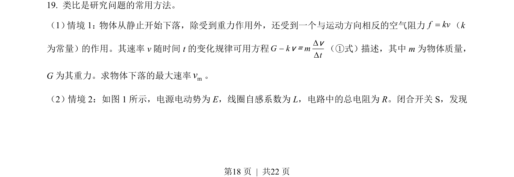
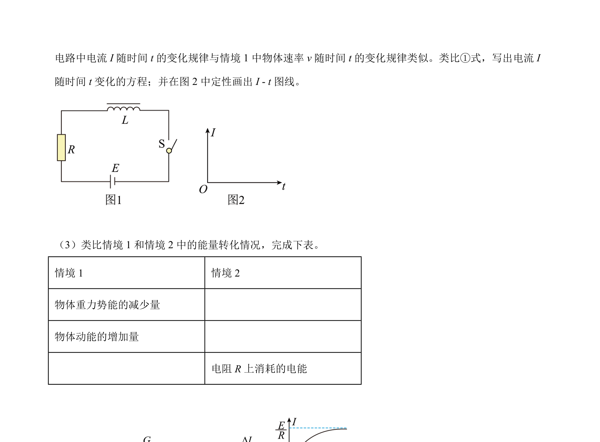
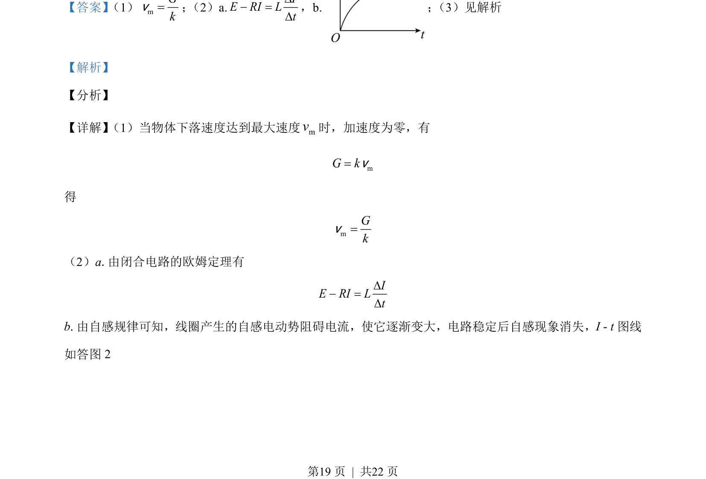
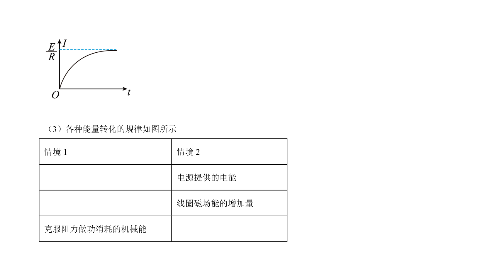

## 题面

## 摘要

本题考查电磁感应中导体棒下落最大速度、含自感线圈的电路分析及能量转化问题。

## 关联考点

- [[604-平衡条件|平衡条件]]
- [[332-闭合电路欧姆定律|闭合电路欧姆定律]]
- [[411-自感|自感]]
- [[197-能量守恒定律|能量守恒]]

## 答案与解析

> 📄 原 PDF 第 18 页：`素材/真题/北京/2008-2024·（北京）物理高考真题/2021年高考物理试卷（北京）（解析卷）.pdf`
