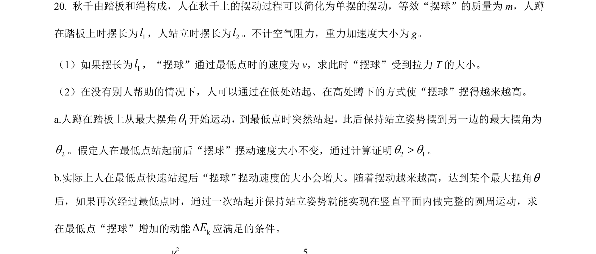
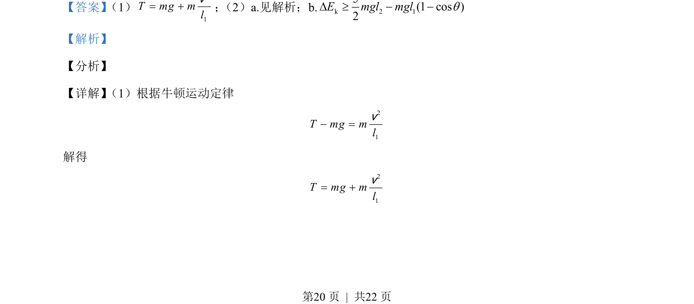
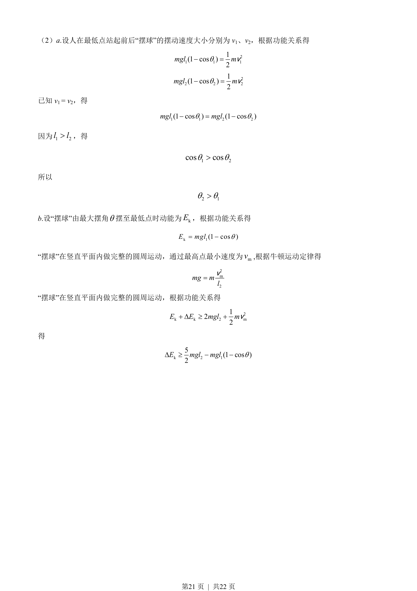

## 题面

## 摘要

该题结合单摆与圆周运动模型，考查牛顿运动定律、功能关系以及竖直面内完整圆周运动的临界条件。

## 关联考点

- [[1176-牛顿运动定律|牛顿运动定律]]
- [[249-功能关系|功能关系]]
- [[圆周运动临界速度]]
- [[085-机械能守恒-初中|机械能守恒]]

## 答案与解析

> 📄 原 PDF 第 20 页：`素材/真题/北京/2008-2024·（北京）物理高考真题/2021年高考物理试卷（北京）（解析卷）.pdf`
