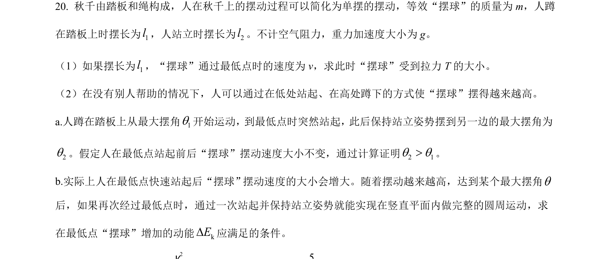
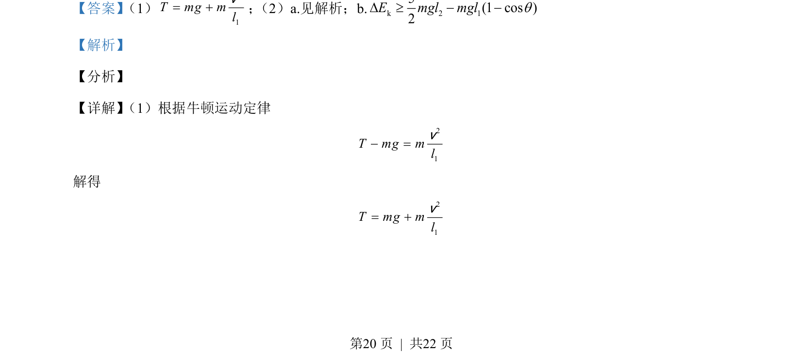
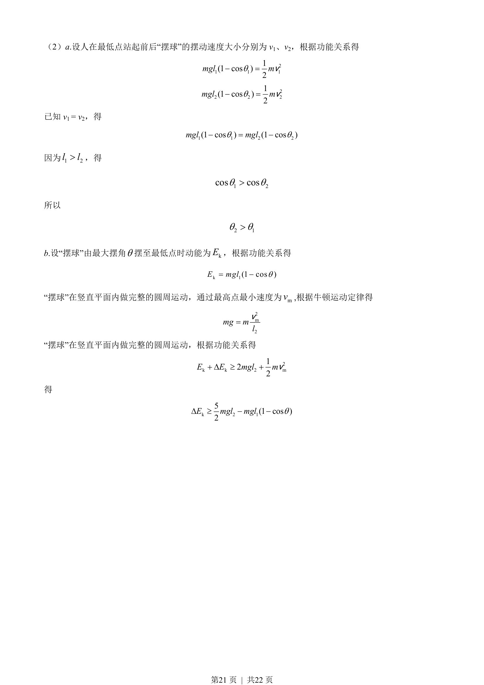

## 题面

## 摘要

该题结合单摆与圆周运动模型，考查牛顿运动定律、功能关系以及竖直面内完整圆周运动的临界条件。

## 关联考点

- [[1176-牛顿运动定律|牛顿运动定律]]
- [[249-功能关系|功能关系]]
- [[圆周运动临界速度]]
- [[085-机械能守恒-初中|机械能守恒]]

## 答案与解析

> 📄 原 PDF 第 20 页：`素材/真题/北京/2008-2024·（北京）物理高考真题/2021年高考物理试卷（北京）（解析卷）.pdf`

<!-- 题干文本-start -->
## 题干文本
20. 秋千由踏板和绳构成，人在秋千上的摆动过程可以简化为单摆的摆动，等效“摆球”的质量为 m，人蹲
在踏板上时摆长为1l，人站立时摆长为2l。不计空气阻力，重力加速度大小为 g。
（1）如果摆长为1l，“摆球”通过最低点时的速度为 v，求此时“摆球”受到拉力 T 的大小。
（2）在没有别人帮助的情况下，人可以通过在低处站起、在高处蹲下的方式使“摆球”摆得越来越高。
a.人蹲在踏板上从最大摆角1开始运动， 到最低点时突然站起， 此后保持站立姿势摆到另一边的最大摆角为
2。假定人在最低点站起前后“摆球”摆动速度大小不变，通过计算证明2 1 >。
b.实际上人在最低点快速站起后“摆球”摆动速度的大小会增大。随着摆动越来越高，达到某个最大摆角
后，如果再次经过最低点时，通过一次站起并保持站立姿势就能实现在竖直平面内做完整的圆周运动，求
在最低点“摆球”增加的动能kED应满足的条件。
<!-- 题干文本-end -->

<!-- 解析文本-start -->
## 解析文本
【答案】 （1）
21T mg ml= +v； （2）a.见解析；b.k 2 15(1 cos )2E mgl mglD ³ - -
【解析】
【分析】
【详解】 （1）根据牛顿运动定律
21T mg ml- =v
解得
21T mg ml= +v
<!-- 解析文本-end -->
