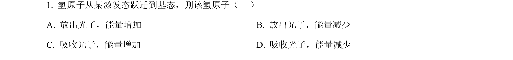
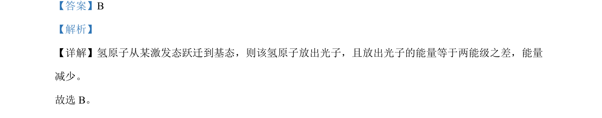

## 题面

## 摘要

氢原子从激发态跃迁到基态时放出光子，能量减少。

## 关联考点

- [[758-氢原子能级跃迁|氢原子能级跃迁]]
- [[837-光子发射|光子发射]]
- [[197-能量守恒定律|能量守恒]]

## 答案与解析

> 📄 原 PDF 第 1 页：`素材/真题/北京/2008-2024·（北京）物理高考真题/2022年高考物理试卷（北京）（解析卷）.pdf`
