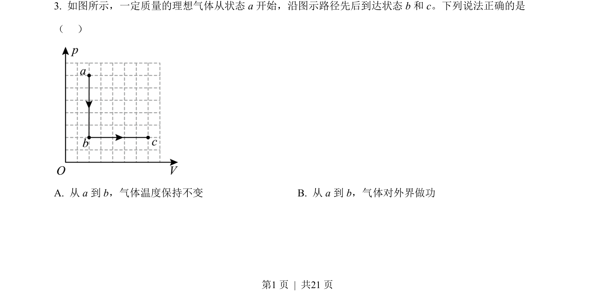
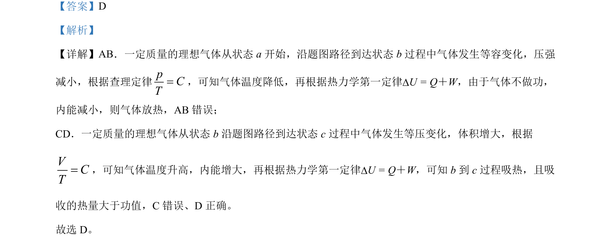

## 题面

## 摘要

理想气体状态变化分析，判断等容降压与等压膨胀过程中的温度、内能变化及吸放热情况

## 关联考点

- [[446-理想气体状态方程|理想气体状态方程]]
- [[430-查理定律|查理定律]]
- [[447-盖吕萨克定律|盖-吕萨克定律]]
- [[440-热力学第一定律|热力学第一定律]]

## 答案与解析

> 📄 原 PDF 第 1 页：`素材/真题/北京/2008-2024·（北京）物理高考真题/2022年高考物理试卷（北京）（解析卷）.pdf`
