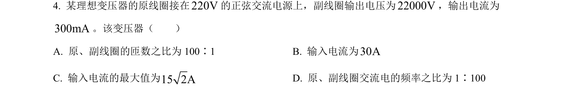
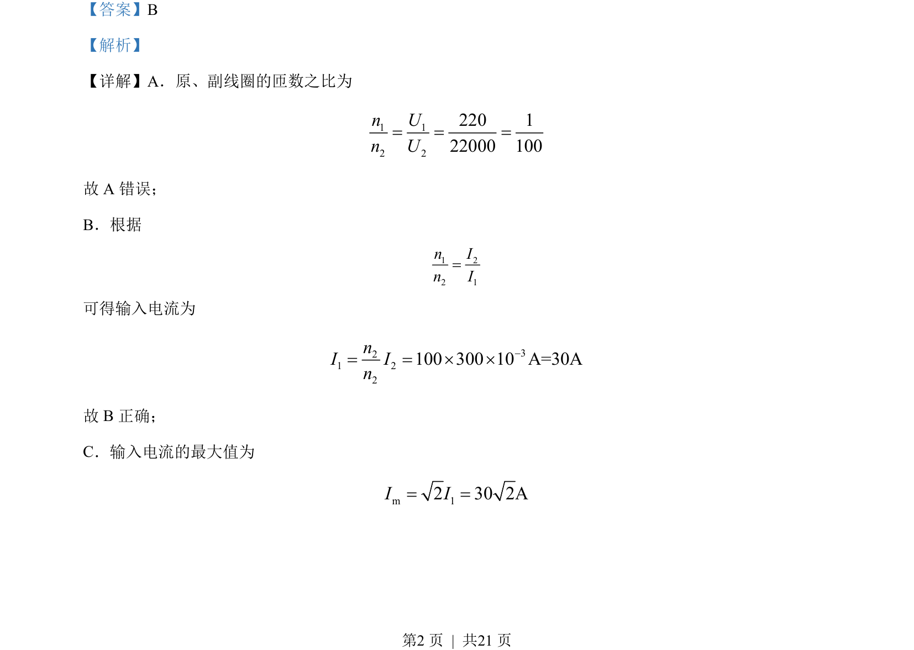
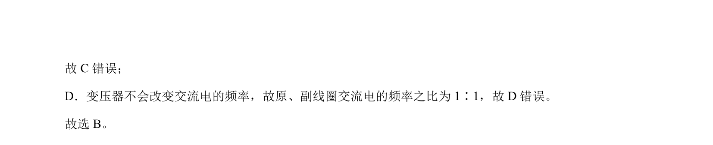

## 题面

## 摘要

理想变压器原副线圈匝数比、输入电流及频率关系的基本计算。

## 关联考点

- [[398-理想变压器|理想变压器]]
- [[电压与匝数比]]
- [[电流与匝数比]]
- [[交流电频率]]

## 答案与解析

> 📄 原 PDF 第 2 页：`素材/真题/北京/2008-2024·（北京）物理高考真题/2022年高考物理试卷（北京）（解析卷）.pdf`
