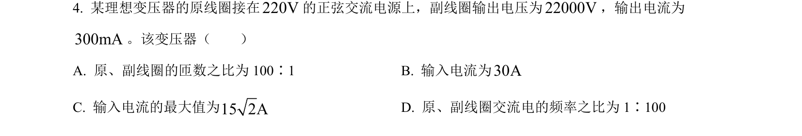
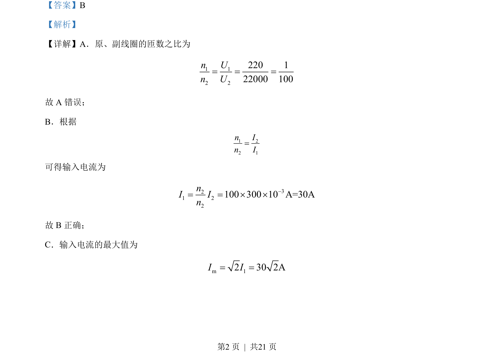
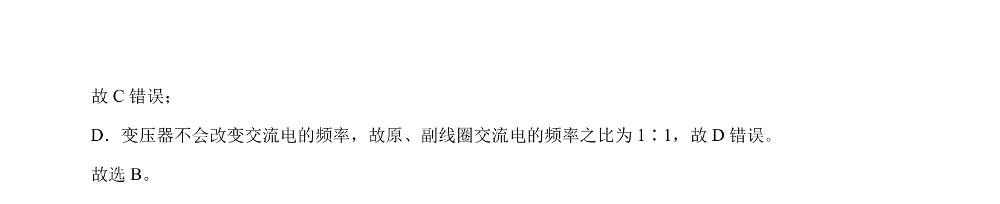

## 题面

## 摘要

理想变压器原副线圈匝数比、输入电流及频率关系的基本计算。

## 关联考点

- [[398-理想变压器|理想变压器]]
- [[电压与匝数比]]
- [[电流与匝数比]]
- [[交流电频率]]

## 答案与解析

> 📄 原 PDF 第 2 页：`素材/真题/北京/2008-2024·（北京）物理高考真题/2022年高考物理试卷（北京）（解析卷）.pdf`

<!-- 题干文本-start -->
## 题干文本
4. 某理想变压器的原线圈接在220V的正弦交流电源上，副线圈输出电压为22000V，输出电流为
300mA。该变压器（　　）
A. 原、副线圈的匝数之比为 100∶1 B. 输入电流为30A
C. 输入电流的最大值为15 2AD. 原、副线圈交流电的频率之比为 1∶100
<!-- 题干文本-end -->

<!-- 解析文本-start -->
## 解析文本
【答案】B
【解析】
【详解】A．原、副线圈的匝数之比为
1 12 2220 122000 100n Un U= = =
故 A 错误；
B．根据
1 22 1n In I=
可得输入电流为
321 22100 300 10 A=30AnI In-= = ´ ´
故 B正确；
C．输入电流的最大值为
m 12 30 2AI I= =
<!-- 解析文本-end -->
