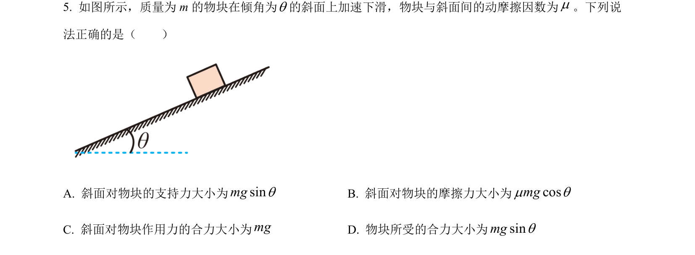
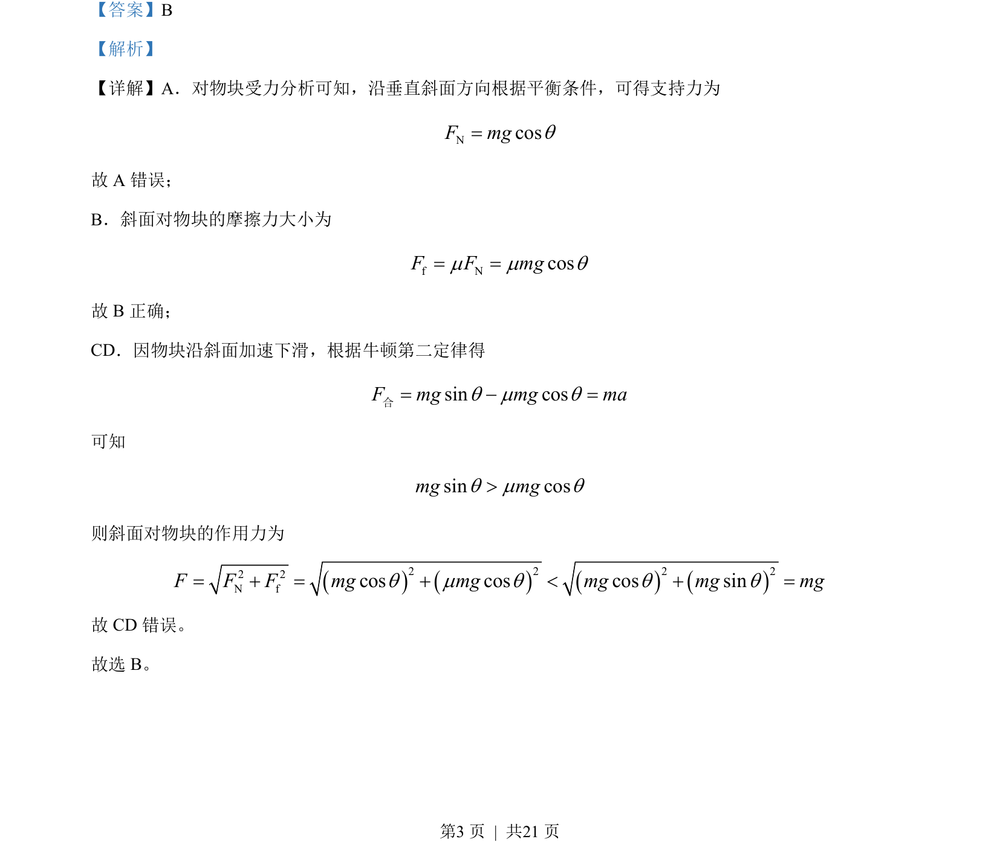

## 题面

## 摘要

分析物块在粗糙斜面加速下滑时的受力、支持力、摩擦力及斜面作用力

## 关联考点

- [[460-受力分析|受力分析]]
- [[097-滑动摩擦力|滑动摩擦力]]
- [[229-牛顿第二定律|牛顿第二定律]]
- [[059-力的合成-初中|力的合成]]

## 答案与解析

> 📄 原 PDF 第 3 页：`素材/真题/北京/2008-2024·（北京）物理高考真题/2022年高考物理试卷（北京）（解析卷）.pdf`

<!-- 题干文本-start -->
## 题干文本
5. 如图所示，质量为 m 的物块在倾角为q的斜面上加速下滑，物块与斜面间的动摩擦因数为μ。下列说
法正确的是（　　）
A. 斜面对物块的支持力大小为sinmgqB. 斜面对物块的摩擦力大小为cosmgμ q
C. 斜面对物块作用力的合力大小为mgD. 物块所受的合力大小为sinmgq
<!-- 题干文本-end -->

<!-- 解析文本-start -->
## 解析文本
【答案】B
【解析】
【详解】A．对物块受力分析可知，沿垂直斜面方向根据平衡条件，可得支持力为
NcosF mgq=
故 A 错误；
B．斜面对物块的摩擦力大小为
f NcosF F mgμ μ q= =
故 B正确；
CD．因物块沿斜面加速下滑，根据牛顿第二定律得
sin cosF mg mg maq μ q= - =合
可知
sin cosmg mgq μ q>
则斜面对物块的作用力为
()()()()2 2 2 22 2N fcos cos cos sinF F F mg mg mg mg mgq μ q q q= + = + < + =
故 CD 错误。
故选 B。
<!-- 解析文本-end -->
