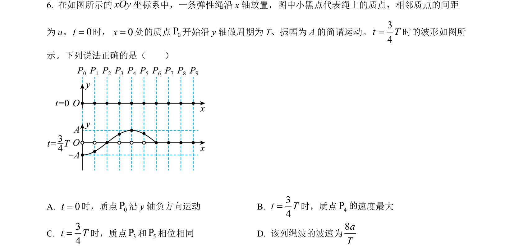
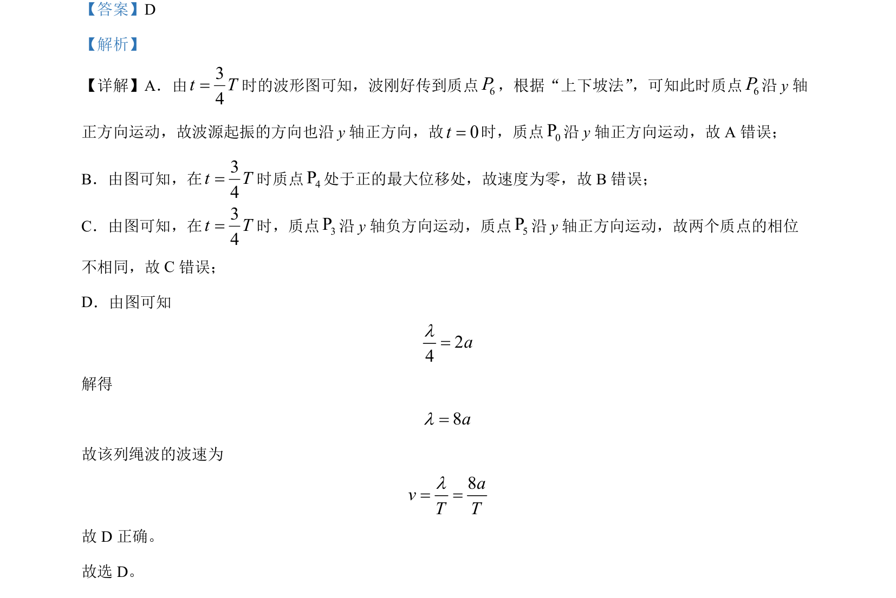

## 题面

## 摘要

该题考查绳波传播的波形图分析，涉及波源起振方向、质点速度及相位关系，并计算波长与波速。

## 关联考点

- [[362-机械波|机械波]]
- [[365-波的图象|波形图]]
- [[765-质点振动方向|质点振动方向]]
- [[369-波速|波速]]
- [[370-波长|波长]]

## 答案与解析

> 📄 原 PDF 第 4 页：`素材/真题/北京/2008-2024·（北京）物理高考真题/2022年高考物理试卷（北京）（解析卷）.pdf`
