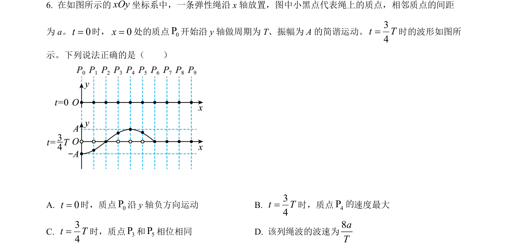
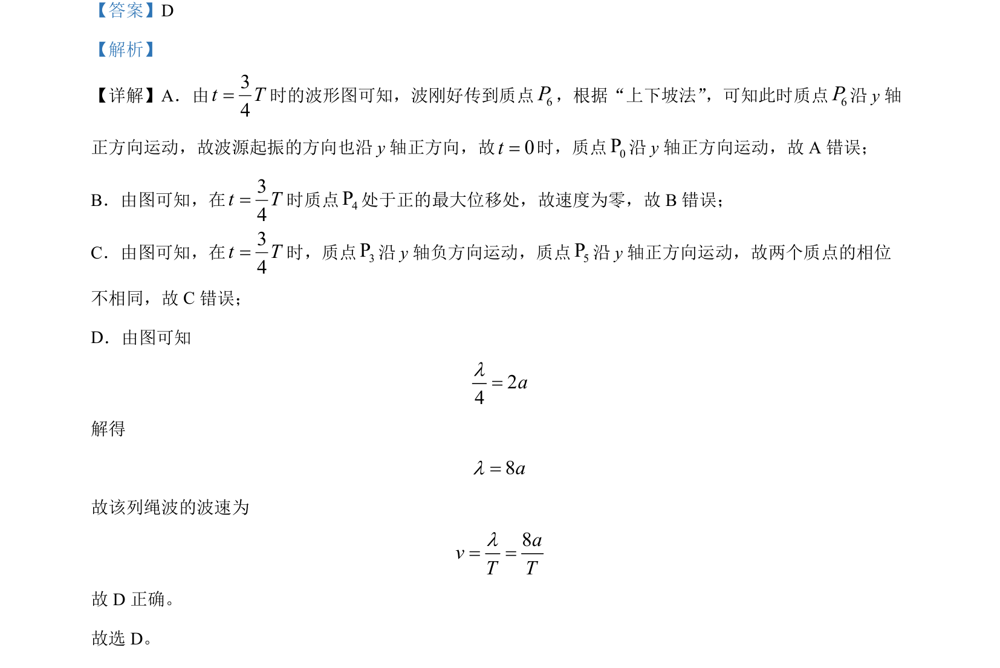

## 题面

## 摘要

该题考查绳波传播的波形图分析，涉及波源起振方向、质点速度及相位关系，并计算波长与波速。

## 关联考点

- [[362-机械波|机械波]]
- [[365-波的图象|波形图]]
- [[764-质点振动方向|质点振动方向]]
- [[369-波速|波速]]
- [[370-波长|波长]]

## 答案与解析

> 📄 原 PDF 第 4 页：`素材/真题/北京/2008-2024·（北京）物理高考真题/2022年高考物理试卷（北京）（解析卷）.pdf`

<!-- 题干文本-start -->
## 题干文本
6. 在如图所示的xOy坐标系中，一条弹性绳沿 x轴放置，图中小黑点代表绳上的质点，相邻质点的间距
为 a。0=t时，0x=处的质点0P开始沿 y轴做周期为 T、振幅为 A的简谐运动。34t T=时的波形如图所
示。下列说法正确的是（　　）
A. 0=t时，质点0P沿 y轴负方向运动 B. 34t T=时，质点4P速度最大
C. 34t T=时，质点3P和5P相位相同 D. 该列绳波的波速为8aT
<!-- 题干文本-end -->

<!-- 解析文本-start -->
## 解析文本
【答案】D
【解析】
【详解】A．由34t T=时的波形图可知，波刚好传到质点6P，根据“上下坡法”，可知此时质点6P沿 y轴
正方向运动，故波源起振的方向也沿 y轴正方向，故0=t时，质点0P沿 y轴正方向运动，故 A 错误；
B．由图可知，在34t T=时质点4P处于正的最大位移处，故速度为零，故 B错误；
C．由图可知，在34t T=时，质点3P沿 y轴负方向运动，质点5P沿 y轴正方向运动，故两个质点的相位
不相同，故 C错误；
D．由图可知
24al=
解得
8al=
故该列绳波的波速为
8avT Tl= =
故 D 正确。
故选 D。
<!-- 解析文本-end -->
