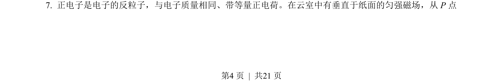
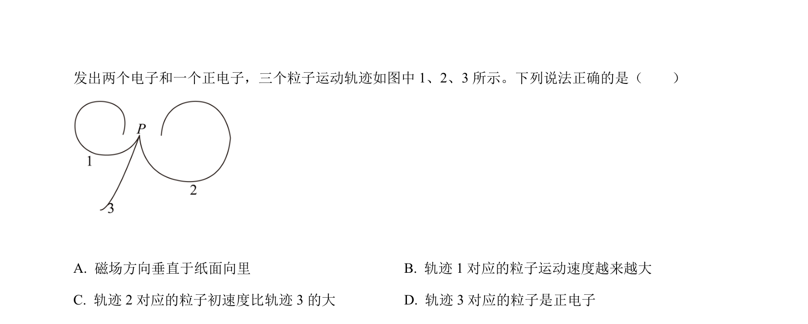
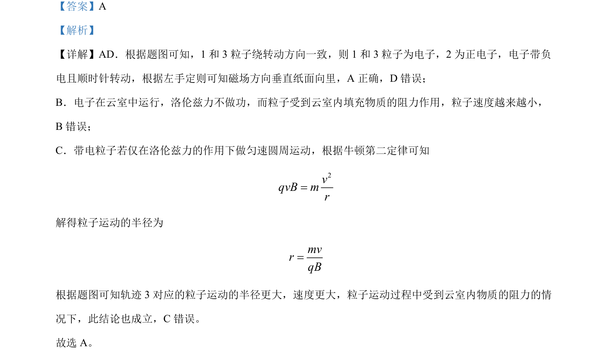

## 题面

## 摘要

带电粒子在磁场中的偏转，结合轨迹判断粒子电性、磁场方向及速度变化。

## 关联考点

- [[469-带电粒子在磁场中的运动|带电粒子在磁场中的运动]]
- [[297-安培力方向-左手定则|左手定则]]
- [[304-洛伦兹力|洛伦兹力]]
- [[761-半径公式|半径公式]]

## 答案与解析

> 📄 原 PDF 第 4 页：`素材/真题/北京/2008-2024·（北京）物理高考真题/2022年高考物理试卷（北京）（解析卷）.pdf`
