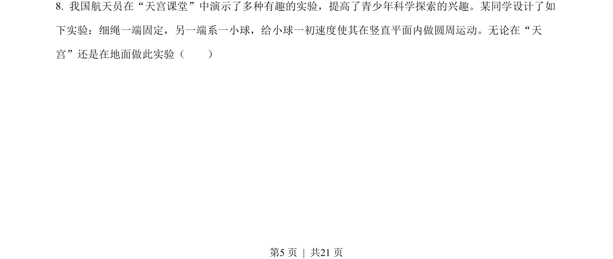
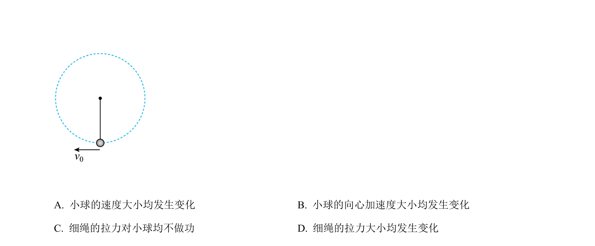
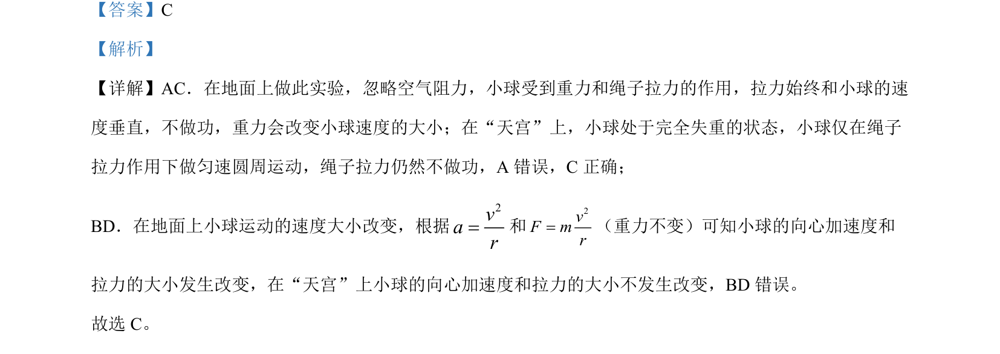

## 题面

## 摘要

比较地面与空间站中小球圆周运动，分析重力、拉力做功及向心加速度变化。

## 关联考点

- [[258-圆周运动|圆周运动]]
- [[256-向心力|向心力]]
- [[完全失重]]
- [[062-功-物理|功]]

## 答案与解析

> 📄 原 PDF 第 5 页：`素材/真题/北京/2008-2024·（北京）物理高考真题/2022年高考物理试卷（北京）（解析卷）.pdf`
