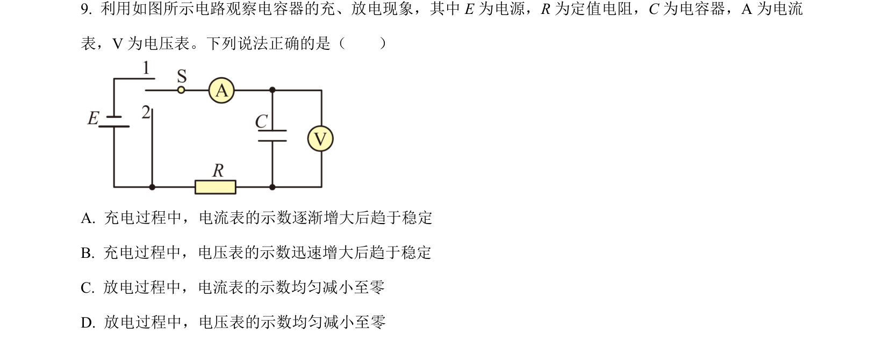
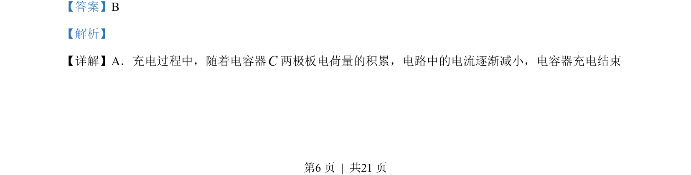
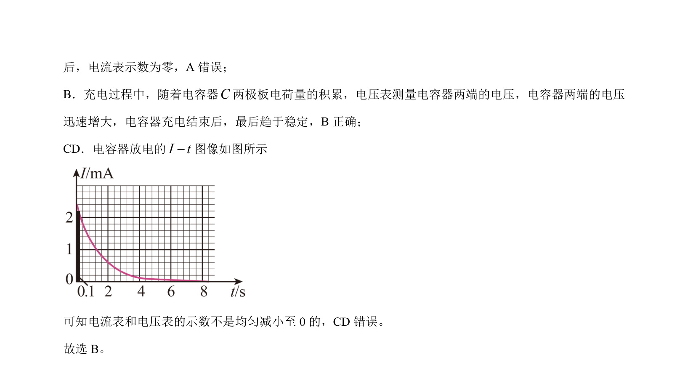

## 题面

## 摘要

电容器充放电过程中电流与电压的变化规律分析，考查电路暂态过程的基本特征。

## 关联考点

- [[313-电容器|电容器]]
- [[516-充放电|充放电]]
- [[电流衰减]]
- [[电压变化]]

## 答案与解析

> 📄 原 PDF 第 6 页：`素材/真题/北京/2008-2024·（北京）物理高考真题/2022年高考物理试卷（北京）（解析卷）.pdf`
