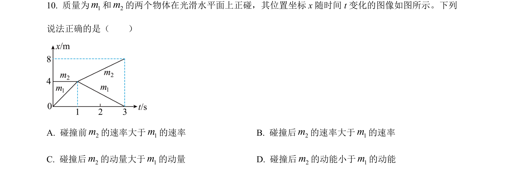
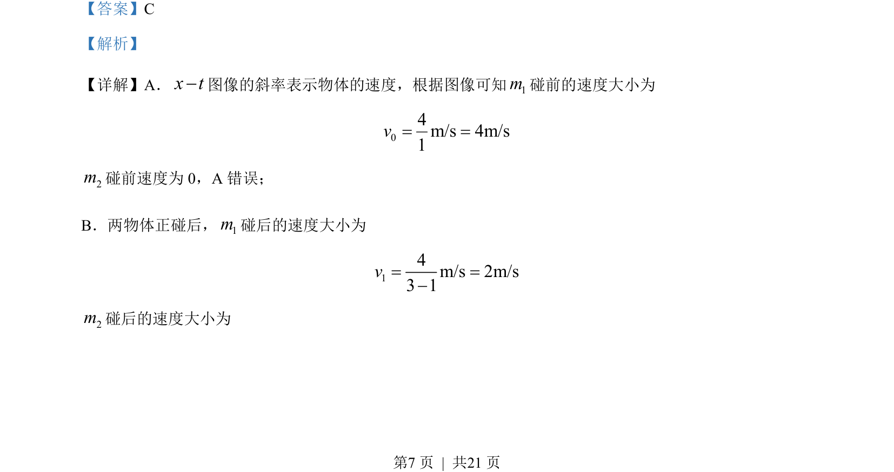
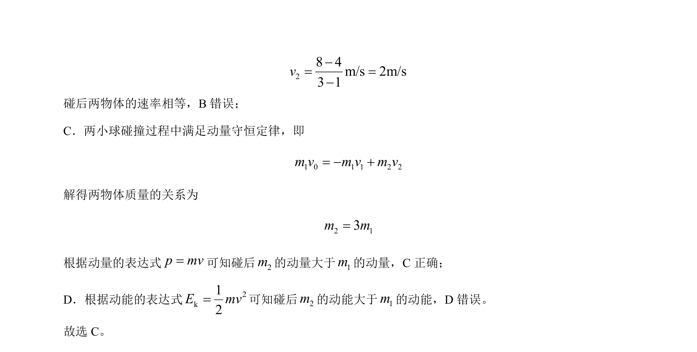

## 题面

## 摘要

一维碰撞问题，结合位移-时间图像分析速度、动量守恒及动能关系。

## 关联考点

- [[位移-时间图像]]
- [[347-动量守恒定律|动量守恒定律]]
- [[346-动量|动量]]
- [[067-动能|动能]]
- [[372-碰撞|碰撞]]

## 答案与解析

> 📄 原 PDF 第 7 页：`素材/真题/北京/2008-2024·（北京）物理高考真题/2022年高考物理试卷（北京）（解析卷）.pdf`
